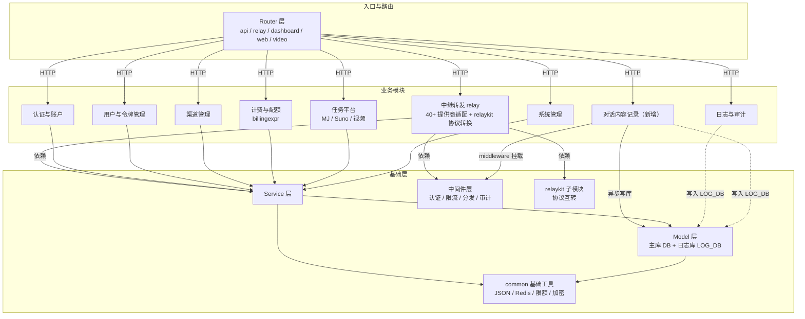

# new-api AI 网关（sili-smart-trace）- 系统架构文档

## 1. 基础技术框架

### 1.1 技术栈选择

本项目是一个用 Go 构建的 AI API 网关/代理（new-api 衍生分支），在统一 API 之后聚合 40 多家上游 AI 提供商，并提供用户管理、计费、限流与管理后台。架构目标是单一二进制部署，前后端一体化交付，通过双数据库连接实现业务数据与日志数据的物理隔离。

架构设计基于现有代码的事实展开，不涉及技术栈重写。以下技术栈均已在代码库中落地，本架构文档对其分层职责、模块划分、存储方案与外部系统关联做整体性说明。

#### 后端技术框架

- **框架**：Gin v1.9.1
- **语言**：Go 1.25.1
- **ORM**：GORM v2（`gorm.io/driver/clickhouse` v0.6.0、`glebarez/sqlite`、MySQL、PostgreSQL 驱动）
- **构建工具**：Go Modules（`relaykit/` 为独立子模块，通过 replace 引用）
- **测试框架**：testify v1.11.1
- **核心依赖**：go-redis v8、casbin v2、golang-jwt v5、go-i18n v2、ClickHouse clickhouse-go v2、shopspring/decimal、bytedance/gopkg（gopool）、gin-contrib（cors/gzip/static）、samber/lo、tiktoken-go、grafana/pyroscope-go

#### 前端技术框架

- **框架**：React 19 + TypeScript
- **UI 组件库**：Base UI + shadcn 风格组件（`web/src/components/ui`）
- **状态管理**：Zustand（`web/src/stores`）
- **路由**：TanStack Router（file-based，`routeTree.gen.ts`）
- **样式**：Tailwind CSS
- **构建工具**：Rsbuild
- **包管理器**：Bun（优先于 npm/yarn/pnpm）

#### 数据库选择

- **主数据库**：SQLite / MySQL >= 5.7.8 / PostgreSQL >= 9.6，按 `SQL_DSN` 选择，默认 SQLite（`one-api.db`）
- **日志数据库**：`LOG_DB`，走独立 DSN `LOG_SQL_DSN`，可独立配置为 ClickHouse；默认复用主库
- **字符集**：utf8mb4

双库分离是系统的核心存储架构：主库 `model.DB` 承载业务数据（用户、令牌、渠道、计费、订阅等 31 张表），日志库 `model.LOG_DB` 承载日志数据（`logs` 表，以及对话内容记录的 `conversation_turns` 表）。两库通过 `common/database.go` 的 `UsingMainDatabase` / `UsingLogDatabase` 显式区分方言与访问路径，日志库类型独立于主库类型维护。ClickHouse 仅允许作为日志库，`chooseDB` 在 `SQL_DSN` 指向 ClickHouse 时直接拒绝。

#### 中间件和基础设施

| 组件 | 推荐技术 | 用途 | 可选性 |
|------|----------|------|--------|
| 缓存 | Redis（go-redis v8）+ 内存缓存（cachex 混合缓存） | 渠道缓存、会话缓存、令牌缓存、限流计数器、配额看板 | 必选（Redis 未配置时退化为进程内） |
| 日志存储 | ClickHouse（clickhouse-server） | `logs` 表与 `conversation_turns` 表的列式存储、按月分区、TTL 自动清理 | 可选（默认复用主库） |
| 应用日志 | 自实现 logger（标准库 log + gin writer 包装） | 后端运行日志，按时间戳文件轮转 | 必选 |
| 异步编排 | bytedance/gopkg gopool | 日志写入、渠道缓存同步、审计等异步任务 | 必选 |
| 性能剖析 | Pyroscope + pprof（`ENABLE_PPROF`） | 运行 profiling，`grafana/pyroscope-go` | 可选 |
| 定时任务 | 自实现 SystemTask 调度 | 日志清理、渠道测试、上游模型更新、任务轮询 | 必选 |
| 鉴权 | casbin v2 + JWT + WebAuthn + OAuth | 细粒度权限矩阵、登录与 API Key 鉴权 | 必选 |
| 前端交付 | `//go:embed web/dist` | 前端产物内嵌进 Go 二进制，单一制品交付 | 必选 |
---

## 2. 模块划分和模块间依赖关系

### 2.1 系统模块分层架构

后端遵循 Router -> Controller -> Service -> Model 的四层架构，relay 链路额外叠加适配器层与中间件层。

```
Router 层（HTTP 路由：api / relay / dashboard / web / video）
    ↓
Controller 层（请求处理器，参数校验与响应组装）
    ↓
Service 层（业务逻辑）
    ↓
Model 层（数据模型与数据库访问，GORM）
```

**分层职责**：
- **Router 层**：路由分组与中间件挂载。`router/main.go` 汇总 `SetApiRouter` / `SetRelayRouter` / `SetDashboardRouter` / `SetVideoRouter`。relay 路由分组 `relayV1Router` 下分 `httpRouter`（OpenAI/Claude/Gemini HTTP 中转）与 `wsRouter`（WebSocket realtime），另有 `relayGeminiRouter`（/v1beta/models）等独立分组
- **Controller 层**：HTTP handler，接收路由请求、参数校验、调用 service 或 model、返回 JSON。relay 主入口 `controller.Relay` 按 RelayMode 分发
- **Service 层**：业务逻辑承载，覆盖鉴权、计费、渠道选择、协议转换、异步任务、日志生成（`log_info_generate.go`）
- **Model 层**：GORM 数据访问，主库与日志库分离初始化，含方言分支与 ClickHouse 建表逻辑
- **relay 适配器层**：`relay/channel/` 下 40 个提供商子目录实现统一 `Adaptor` 接口；`relaykit/` 独立子模块承载多协议格式互转（Claude ↔ OpenAI ↔ Gemini ↔ Responses）
- **中间件层**：认证（JWT/Session/API Key/Casbin）、限流、CORS、日志、分发（Distribute 渠道选择）、审计、请求体存储等

### 2.2 业务模块划分

模块划分依据代码库目录结构归纳，各模块对应独立的包目录与职责范围。

| 模块 | 职责范围 | 对应目录 | 依赖关系 |
|------|----------|----------|---------|
| 认证与账户 | 登录注册、OAuth（GitHub/Discord/OIDC/LinuxDo）、WebAuthn/Passkeys、二次验证、会话管理 | `controller/auth*.go`、`service/auth*.go`、`service/passkey/`、`oauth/` | 依赖 model、common |
| 用户与令牌管理 | 用户 CRUD、令牌（API Key）CRUD、兑换码、用户分组与配额 | `controller/user.go`、`controller/token.go`、`model/user*.go`、`model/token*.go` | 依赖 model、common |
| 渠道管理 | 上游渠道 CRUD、渠道测试、上游模型同步、渠道亲和性、渠道计费映射 | `controller/channel*.go`、`service/channel*.go`、`model/channel*.go` | 依赖 model、common、setting |
| 中继转发（relay） | 多协议中转、40+ 提供商适配、流式/工具调用、参数覆盖、重试、协议转换 | `relay/`、`relaykit/`、`controller/relay.go` | 依赖 relaykit、common、model、service |
| 计费与配额 | 消费计费、预扣/结算/退款、分层计费表达式（billingexpr）、订阅、充值、限额、违规费 | `service/billing*.go`、`service/quota.go`、`service/text_quota.go`、`pkg/billingexpr/` | 依赖 common（quota_math）、model |
| 任务平台 | Midjourney、Suno、视频（Kling/Jimeng/Sora 等）异步任务调度与轮询 | `relay/task.go`、`relay/channel/task/`、`service/task*.go`、`dto/` | 依赖 model、common、relay |
| 日志与审计 | logs 表读写、消费日志、管理员审计、登录审计、配额饱和审计 | `model/log.go`、`service/log_info_generate.go`、`controller/log.go`、`middleware/audit.go` | 依赖 model（LOG_DB）、common |
| 对话内容记录（新增） | 会话捕获 middleware、协议消息解析、启发式会话识别、会话持久化、管理员查询 | `middleware/`、`service/`、`model/`、`controller/`（各新增对话内容记录文件） | 依赖 model（LOG_DB）、common、middleware |
| 系统管理 | 运行时配置（option/setting）、系统任务、多实例、性能指标、模型/供应商元数据、Casbin 权限 | `setting/`、`model/option.go`、`model/system_task*.go`、`service/system_task.go`、`controller/system_*.go` | 依赖 model、common、authz |
| 管理后台（web） | 用户/渠道/日志/定价/订阅/系统设置等管理界面 | `web/src/features/`、`web/src/routes/` | 依赖后端 `/api/*` |

**模块说明**：
- **中继转发（relay）** 是系统的核心业务模块。`relay_adaptor.go` 的 `GetAdaptor` 依据渠道 APIType 返回 40 个提供商适配器；`relaykit/` 作为独立可构建子模块承载 Claude/OpenAI/Gemini/Responses 之间的协议转换，不依赖根模块，保证模块独立性
- **日志与审计** 与 **对话内容记录** 共享日志库 `LOG_DB`，通过 `request_id` 交叉关联，但不互相依赖：logs 表记计费摘要，conversation_turns 表记对话明文，两者职责正交
- **对话内容记录** 是本次新增的通用技术能力，以最小侵入方式集成：只新增挂于 relay 路由分组的 middleware 与查询 API，不修改任何中转 handler、relay 流程与 RelayInfo

### 2.3 模块间依赖关系图



**依赖关系说明**：
- 全部业务模块依赖 Service、Model、common 基础层，通过同进程函数调用通信，无循环依赖
- **对话内容记录** 依赖 middleware（挂载点）、model（LOG_DB 写入）、common（Redis 会话缓存、JSON 包装、上下文取值），不依赖 relay 具体 handler
- 日志模块与对话内容记录模块均写入 `LOG_DB`，物理隔离于主库业务数据
- `relaykit/` 独立于根模块构建，是唯一的子模块级解耦点

### 2.4 模块间通信方式

| 场景 | 通信方式 | 说明 |
|------|----------|------|
| 路由到业务逻辑 | 同步函数调用 | Router -> Controller -> Service -> Model，同进程调用 |
| 渠道与模型状态共享 | Redis 缓存 | 渠道缓存、模型定价、令牌缓存，多副本共享，`cachex` 混合缓存兜底 |
| 日志异步写库 | gopool goroutine | 日志写入、对话内容记录写库经 `gopool.Go` 异步编排，不阻塞响应路径 |
| 定时任务 | 自实现 SystemTask 调度 | 日志清理、渠道测试、上游模型更新、任务轮询，多实例经 `SystemTaskLock` 抢占 |
| 会话状态同步 | Redis 键值 | 对话内容记录的会话指纹映射、令牌缓存等，多实例跨节点共享 |
| 前端与后端 | REST API | `web/` 通过 `/api/*` 与后端交互，前端产物经 `go:embed` 内嵌 |

### 2.5 新增模块内部结构

对话内容记录组件遵循最小侵入约束，向现有四个 package 各新增一个对话内容记录文件，不创建新目录、不改动既有文件的结构与依赖。目录结构保持现有分层不变：

```
middleware/                       # 新增：挂载于 relay 路由分组的捕获中间件
service/                          # 新增：协议消息解析、用量解析、会话识别、写入编排、合并查询
model/                            # 新增：会话模型、幂等建表、读写与聚合查询
controller/                       # 新增：管理员会话列表与详情查询 API
```

**说明**：
- 组件挂载点固定在 `router/relay-router.go`（httpRouter 与 relayGeminiRouter 两处 `Use`）与 `router/api-router.go`（两条管理员查询路由），属既有文件的两处最小改动
- `conversation_turns` 表存储走日志库 `LOG_DB`，与 logs 表共用 ClickHouse 方言分支（TTL 配置各自独立：conversation_turns 读 `LOG_CONVERSATION_CLICKHOUSE_TTL_DAYS`，logs 读 `LOG_SQL_CLICKHOUSE_TTL_DAYS`），`request_id` 与 logs 表交叉关联
- 会话识别依赖 Redis（按 token 分桶 `conv:session:{token_id}` 键存多会话槽位 JSON 数组 `[]sessionSlot{Fingerprint,SessionKey,Count,ActiveTime}`，TTL 30 分钟，槽位上限 32；本轮请求条数严格增长且全字段指纹命中某槽位前缀即续链复用其 sessionKey 并刷新指纹，全不命中追加新槽），Redis 未配置时退化为进程内 map 单实例模式
- 功能开关 `CONVERSATION_LOG_ENABLED` 走环境变量，关闭时 middleware 直接透传，近似零开销

---

## 3. 本系统与外部系统的关联

### 3.1 本系统调用外部系统的接口（集成外部服务）

本系统作为调用方，通过 HTTP RESTful API 或 SDK 调用外部服务，主要包括三类：AI 上游提供商、支付服务商、身份提供方。

#### 3.1.1 AI 上游提供商集成

通过 `relay/channel/` 下 40 个提供商适配器统一调用。核心交互协议为 OpenAI 兼容格式、Anthropic Messages 格式、Google Gemini 原生格式，经 relaykit 做协议互转。

| 接口名称 | 用途 | 交互方式 | 数据流向 | 集成方式 |
|----------|------|----------|----------|----------|
| Chat Completions（OpenAI 兼容） | 文本对话、工具调用、流式 | HTTP REST / SSE 流式 | 客户端 -> 网关 -> 上游 | 同步（流式按块转发） |
| Messages（Anthropic Claude） | 文本对话、工具调用、流式 | HTTP REST / SSE 流式 | 客户端 -> 网关 -> 上游 | 同步 |
| generateContent（Gemini） | 文本对话、多模态、流式 | HTTP REST / SSE 流式 | 客户端 -> 网关 -> 上游 | 同步 |
| Responses API | OpenAI 新一代会话接口 | HTTP REST / SSE 流式 | 客户端 -> 网关 -> 上游 | 同步 |
| Embeddings / Images / Audio / Rerank | 非对话类模型调用 | HTTP REST | 客户端 -> 网关 -> 上游 | 同步 |
| Realtime | 实时语音会话 | WebSocket | 客户端 -> 网关 -> 上游 | 双向流式 |
| Bedrock / Vertex / Azure | 云平台托管模型 | SDK / 鉴权包装 | 客户端 -> 网关 -> 云平台 | 同步 |
| 任务类接口（MJ / Suno / 视频） | 异步生成任务 | HTTP REST + 轮询 | 客户端 -> 网关 -> 上游 -> 轮询结果 | 异步 |

**使用场景**：
- 中继转发：全部 `/v1/*`、`/v1/messages`、`/v1beta/models/*` 请求按渠道选择结果转发到上游
- 多提供商聚合：同一模型可配置多个上游渠道，按配额、优先级与亲和性分发

**错误处理和重试机制**：
- 超时时间：由渠道级配置控制（`service/http_client*.go` 定义 HTTP 客户端）
- 重试次数：relay 主流程支持按渠道失败重试
- 失败降级：渠道自动禁用与切换，`SystemPerformanceCheck` 在系统负载过高时拒绝新请求

#### 3.1.2 支付服务商集成

| 接口名称 | 用途 | 交互方式 | 数据流向 | 集成方式 |
|----------|------|----------|----------|----------|
| Stripe | 信用卡订阅与充值 | REST API + Webhook | 网关 -> Stripe，Webhook -> 网关 | 同步 + 异步回调 |
| Creem / Epay / Waffo | 订阅与充值 | REST API + 回调 | 网关 -> 服务商 | 同步 + 回调 |
| Waffo-Pancake | 充值 | REST API | 网关 -> 服务商 | 同步 |

**错误处理和重试机制**：
- Webhook 幂等处理，回调失败记录日志供人工核对
- 充值入账走事务与日志审计（`RecordTopupLog`）

#### 3.1.3 身份提供方集成（OAuth）

| 接口名称 | 用途 | 交互方式 | 数据流向 | 集成方式 |
|----------|------|----------|----------|----------|
| GitHub OAuth | 第三方登录 | OAuth2 授权码 | 网关 -> GitHub | 同步 |
| Discord OAuth | 第三方登录 | OAuth2 授权码 | 网关 -> Discord | 同步 |
| OIDC（含自定义 Provider） | 企业身份登录 | OpenID Connect | 网关 -> IdP | 同步 |
| LinuxDo OAuth | 第三方登录 | OAuth2 授权码 | 网关 -> LinuxDo | 同步 |

`oauth/registry.go` 统一注册各 Provider，`controller.HandleOAuth` 统一调度；自定义 OIDC Provider 支持动态加载（`oauth.LoadCustomProviders`）。

### 3.2 本系统提供给外部的接口（对外暴露服务接口）

本系统作为提供方，对外开放 OpenAI 兼容 API，供客户端 SDK、第三方应用与下游网关调用。

**使用场景**：
- OpenAI 兼容客户端（OpenAI SDK、LiteLLM、LangChain 等）经 `/v1/*` 直接接入
- 下游 new-api 网关互连（`relay/channel/newapi` 适配器）
- 管理后台与仪表盘经 `/api/*`、`/dashboard/billing/*` 访问

**注意**：
- `/v1/*` 中继接口以 API Key（`Authorization: Bearer`）鉴权，由 `TokenAuth` 中间件校验
- `/api/*` 管理接口按用户角色（User/Admin/Root）与 Casbin 权限矩阵鉴权
- `/v1/models` 等公开能力接口按 header 分流到对应上游格式

### 3.3 接口清单

| 外部系统 | 交互方式 | 集成方式 | 错误处理 |
|----------|----------|----------|----------|
| AI 上游提供商（40+） | HTTP REST / SSE / WebSocket | 同步/异步轮询 | 渠道重试、禁用、亲和性切换 |
| Stripe / Creem / Epay / Waffo | REST + Webhook | 同步 + 回调 | 回调幂等、日志审计 |
| GitHub / Discord / OIDC / LinuxDo | OAuth2 / OIDC | 同步 | 授权失败重定向错误页 |
| 客户端 SDK（OpenAI 兼容） | REST / SSE | 同步 | 标准 OpenAI 错误体返回 |
| 下游网关（new-api） | REST | 同步 | 标准错误体 |
| ClickHouse 日志库 | clickhouse:// TCP | 异步写入 | 写入失败记日志，不影响响应 |

---

## 4. 架构约束

### 4.1 性能要求

#### 响应时间要求

| 场景 | 目标响应时间 | 说明 |
|------|-------------|------|
| 管理 API | < 500ms | `/api/*` 常规读写，慢查询阈值 `SQL_SLOW_THRESHOLD_MS` 默认 200ms 告警 |
| relay 非流式转发 | 由上游决定 + 网关附加延迟 | 网关附加层为内存拷贝与异步落库，不阻塞上游响应 |
| 对话捕获链路 | 附加延迟微秒级 | 请求体走 GetBodyStorage 缓存读取、响应体走 buffer 拷贝，异步写库不阻塞响应 |

#### 并发量要求

| 场景 | 目标并发量 | 说明 |
|------|-------------|------|
| 数据库连接池 | `SQL_MAX_OPEN_CONNS` 默认 1000 | 主库与日志库独立连接池 |
| relay 并发 | 多副本水平扩展 | Redis 缓存共享会话与渠道状态，`SystemInstance` 多实例感知 |
| 在途请求 | `StatsMiddleware` 统计 | 系统负载过高时 `SystemPerformanceCheck` 拒绝新 relay 请求 |

#### 数据量要求

| 场景 | 预估数据量 | 说明 |
|------|-----------|------|
| logs 日志表 | 随用量线性增长 | 定期清理任务（`/api/system-task/log-cleanup`），ClickHouse 下走 TTL + mutation 删除 |
| conversation_turns 表 | 一行一轮，随对话量增长 | ClickHouse 下按月分区 + TTL 自动清理（`LOG_CONVERSATION_CLICKHOUSE_TTL_DAYS`，与 logs 独立） |
| 单次响应捕获 | 上限 256KB | 超限截断并置 `truncated` 标记，避免大响应占用内存 |

### 4.2 安全要求

#### 认证方式

- **方式**：JWT + Session Cookie + API Key 三元并存
- **实现**：golang-jwt v5（JWT）、Session Cookie（`session_cookie.go`）、API Key（`Authorization: Bearer`，`TokenAuth` 中间件）、WebAuthn/Passkeys、OAuth（GitHub/Discord/OIDC/LinuxDo）、二次验证（TOTP + 安全验证）
- **Token 有效期**：JWT 与 Session 过期时间由配置控制，支持刷新
- **登录方式**：密码登录、OAuth 第三方登录、Passkey 无密码登录

#### 授权机制

- **方式**：RBAC + Casbin 细粒度权限矩阵
- **实现**：casbin v2，`service/authz/` 子包（enforcer、registry、role、seed），多节点策略同步
- **权限粒度**：用户角色（User/Admin/Root）+ 功能权限点（RequirePermission），渠道管理按权限矩阵挂载

#### 数据加密

- **传输加密**：HTTPS（TLS 由部署层终止，`ConfigureTrustedProxies` 处理可信代理）
- **存储加密**：令牌密钥加密存储（`common/crypto.go`，token key 不落明文）
- **密码加密**：加盐哈希存储

#### 敏感数据保护

- **字段脱敏**：日志与对话记录不落 token 明文 key，只存 `token_name`；会话详情不回传 ip/channel_id 等整表维度
- **访问审计**：管理/root 写操作经 `middleware/audit.go` 审计，登录行为写登录审计日志
- **数据隔离**：日志库 `LOG_DB` 与主库物理隔离；`admin_info` 嵌套字段仅管理员可见，普通用户查询时经 `formatUserLogs` 剥离

### 4.3 可扩展性要求

本系统按多实例网关设计，具备水平扩展能力，且日志数据量随用量线性增长，因此日志存储采用 ClickHouse 以满足大数据量下的查询与留存需求。

#### 水平扩展能力

- **应用部署**：单一二进制多副本部署，`Dockerfile` 多阶段构建，`docker-compose.yml` 编排 new-api + redis + postgres；Redis 共享缓存（渠道、令牌、会话），`SystemInstance` 感知多实例，`SystemTaskLock` 保证定时任务单实例执行，Casbin 策略多节点同步
- **数据库扩展**：主库与日志库分离，日志库独立扩展为 ClickHouse 集群，主库保持单点或按需读写分离

#### 日志存储扩展（ClickHouse）

- **分区与留存**：`logs` 与 `conversation_turns` 均按 `toYYYYMM(toDateTime(created_at))` 按月分区，`ORDER BY (created_at, request_id)` 保证时间序查询高效，TTL 各自独立配置（`logs` 读 `LOG_SQL_CLICKHOUSE_TTL_DAYS`、`conversation_turns` 读 `LOG_CONVERSATION_CLICKHOUSE_TTL_DAYS`），建表后经 `ALTER TABLE ... MODIFY TTL` 动态对齐
- **方言适配**：ClickHouse 无可靠自增 id 与 `LIMIT ... OFFSET` 同语义聚合，查询侧经 `clickHouseLogOrder` 复合排序、`assignDisplayLogIds` 回填展示 id、`any()` 聚合非分组列、LIKE 转义独立分支处理；删除走 `ALTER TABLE ... DELETE SETTINGS mutations_sync=1` mutation

### 4.4 技术约束

#### 必须使用的技术栈

- **后端框架**：Gin v1.9.1（Go 1.25.1）
- **前端框架**：React 19 + TypeScript
- **数据库**：SQLite / MySQL >= 5.7.8 / PostgreSQL >= 9.6（主库，utf8mb4），ClickHouse（可选日志库）
- **ORM**：GORM v2
- **UI 组件库**：Base UI + Tailwind CSS
- **状态管理**：Zustand
- **缓存**：Redis（go-redis v8）+ 内存缓存
- **鉴权**：casbin v2 + golang-jwt v5
- **国际化**：后端 go-i18n（en/zh），前端 i18next（en/zh/zh-TW/fr/ru/ja/vi）
- **前端构建**：Bun + Rsbuild

#### 禁止的技术

- **数据库**：禁止将 ClickHouse 作为主库（`chooseDB` 强制拒绝）；禁止手工 `AUTO_INCREMENT` / `SERIAL` 主键（主键生成交由 GORM）；禁止未经跨库回退处理使用数据库专有特性（MySQL 专有函数、PostgreSQL 专有操作符、SQLite 不支持的 `ALTER COLUMN` 等）
- **ORM**：禁止 GORM v1 旧式行锁写法 `tx.Set("gorm:query_option", "FOR UPDATE")`（GORM v2 静默忽略），行锁必须走 `lockForUpdate(tx)`
- **JSON**：业务代码禁止直接导入 `encoding/json`，序列化/反序列化必须经 `common.Marshal` / `common.Unmarshal` 等包装函数
- **计费安全**：禁止用裸类型转换把配额或 token 计数转为 int，配额换算必须走 `common/quota_math.go` 的 `QuotaFromFloat` / `QuotaRound` / `QuotaFromDecimal` 及 `*Checked` 变体
- **模块依赖**：`relaykit/` 严禁导入根 `new-api` 模块的包，须独立可构建（`cd relaykit && GOWORK=off go build ./...` 验证）

#### 日志存储约束（ClickHouse）

- 日志数据统一走 `LOG_DB`，经 `UsingLogDatabase` 分支访问；`logs` 与 `conversation_turns` 两表共用 ClickHouse 方言分支
- 建表幂等：`EnsureConversationTable` 由 `sync.Once` 保护；ClickHouse 下走手写 DDL，非 ClickHouse 走 GORM `AutoMigrate`
- 保留字列名：`group` 在日志库 PostgreSQL 用双引号、其余用反引号，经 `logGroupCol` 方言约定处理
- 轮次顺序：写入路径不维护自增序号，查询侧一律 `ORDER BY created_at, request_id` 复合排序，规避 ClickHouse 无自增 id 的竞态

#### 兼容性要求

- **数据库**：全部数据库代码须同时兼容 SQLite、MySQL >= 5.7.8 与 PostgreSQL >= 9.6，迁移须在三库生效；ClickHouse 为日志库专有
- **浏览器**：管理后台为现代浏览器，React 19 + TanStack Router 构建，无旧浏览器兼容约定
- **第三方系统**：对外保持 OpenAI 兼容 API 契约，不破坏既有客户端接入

---

## 5. 附录

### 5.1 技术术语表

| 术语 | 说明 |
|------|------|
| LOG_DB | 日志库，独立于主库，可配置为 ClickHouse |
| relaykit | 独立 Go 子模块，承载 Claude/OpenAI/Gemini/Responses 协议互转 |
| RelayMode | 中继格式枚举，驱动 controller 分发到对应 handler |
| billingexpr | 分层/动态计费表达式 DSL，独立于主模块的可复用计费包 |
| 会话（Session） | 对话内容记录中按 session_key 聚合的多轮对话 |
| 轮次（Turn） | 一次请求/响应对应的一行 conversation_turns 记录 |
| 预扣/结算 | 消费前按估算预扣配额，响应后按实际结算差额或退款 |
| admin_info | logs 表 Other 字段中嵌套的管理员专属审计信息，普通用户查询时剥离 |

### 5.3 变更记录

| 版本 | 日期 | 变更内容 | 作者 |
|------|------|---------|------|
| v1.0 | 2026-08-01 | 初始版本：基于代码事实的整体架构说明，含 ClickHouse 日志存储设计与对话内容记录组件架构 | lixuetao |

---

**文档版本**：v1.0
**创建日期**：2026-08-01
**最后更新**：2026-08-01
