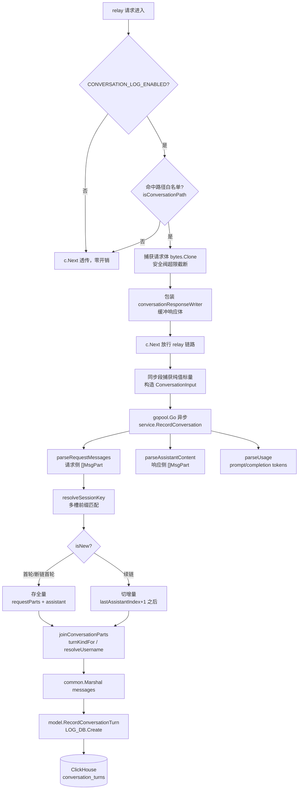
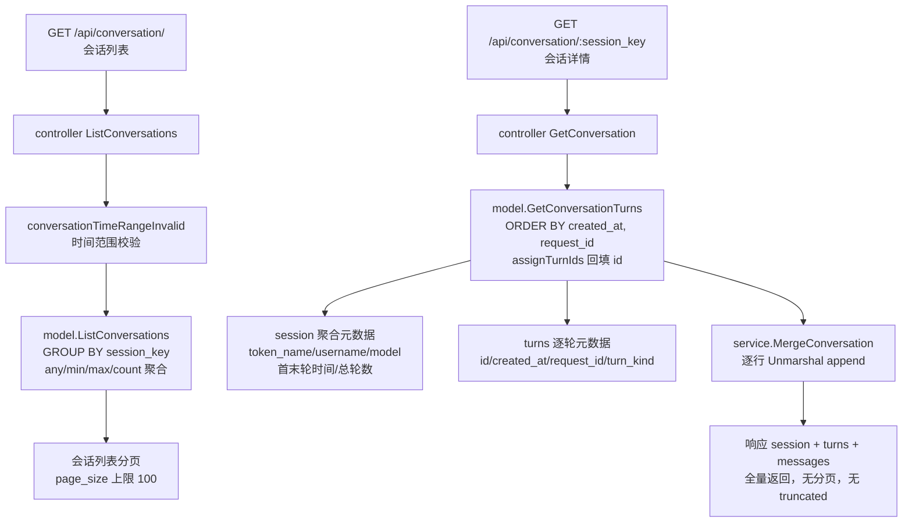

# conversation 会话记录流程

> 本文聚焦对话内容记录功能（`conversation_turns` 表）的端到端数据流：一次对话请求如何被捕获、归并、增量写入 ClickHouse，以及管理员如何查询还原完整对话。每一步标注对应的文件、函数与行号。字段定义、业务规则与已知局限见 specs（`context/05_specs/P1_TECH_001_TECH_对话内容记录/`），本文只描述运行时流程与关键不变量。

功能由四个 package 各一个文件承载，挂载点固定，最小侵入：

```
router/relay-router.go   挂载捕获 middleware（OpenAI/Claude 与 Gemini 两处）
router/api-router.go     注册管理员查询路由
middleware/conversation_log.go   同步捕获请求/响应明文 + 纯值标量
service/conversation.go          协议解析、会话识别、增量组装、写库编排、对话拼接
model/conversation.go            轮次模型、ClickHouse 建表/写库/聚合查询
controller/conversation.go       管理员会话列表与详情查询 API
```

---

## 1. 写入链路（请求 → ClickHouse）



| # | 步骤 | 文件 / 函数（行） | 做了什么 |
|---|------|------------------|---------|
| 1 | 挂载 | `router/relay-router.go:85, :200` `ConversationLog()` | 在 `httpRouter`（OpenAI/Claude）与 `relayGeminiRouter`（Gemini）上挂载，位于 `Distribute()` 之前作为外层中间件，使其 `c.Next()` 后能读到 Distribute 写入的 channel/token/user 等 context 字段 |
| 2 | 开关与白名单 | `middleware/conversation_log.go:21` `ConversationLog` / `:137` `isConversationPath` | 读 `CONVERSATION_LOG_ENABLED`，关则 `c.Next()` 零开销（不读 Body、不包装 writer）；开则按白名单过滤，未命中直接透传。白名单集中一处：OpenAI/Claude 精确匹配，Gemini 后缀匹配 |
| 3 | 捕获请求体 | `middleware/conversation_log.go:43-52` | `GetBodyStorage` 触发缓存 → `Bytes` → `bytes.Clone`（默认全量）；安全阀 `CONVERSATION_LOG_BODY_LIMIT_KB` 超限时按上限截断，丢弃量计入 `requestDropped` |
| 4 | 捕获响应体 | `middleware/conversation_log.go:55-60, :106` `conversationResponseWriter` / `:113` `Write` | 包装 `c.Writer`，同步把响应字节缓冲到 `body`，始终透传底层 writer，不影响客户端接收 |
| 5 | 放行 relay | `middleware/conversation_log.go:63` `c.Next()` | relay 链路正常执行（鉴权、分发、上游中转、计费），捕获中间件不参与中转逻辑 |
| 6 | 同步段取值 | `middleware/conversation_log.go:78-95` | `c.Next()` 后捕获纯值标量（request_id、model、channel/token/user id、token_name、group、ip、is_stream、use_time、upstream_request_id），`bytes.Clone` 取出响应体，构造 `service.ConversationInput` |
| 7 | 异步触发 | `middleware/conversation_log.go:97-99` `gopool.Go` → `service.RecordConversation`(`:1263`) | 闭包只捕获 `input` 纯值快照，不阻塞响应。`RecordConversation` 内部再起一个 `gopool.Go`(`:1264`) 执行步骤 8-15 |
| 8 | 解析请求侧 | `service/conversation.go:116` `parseRequestMessages` | 按 path 分派协议（OpenAI/Claude/Gemini/Responses），把请求体 messages 归一化为 `[]MsgPart{role,kind,text}`，role=tool/tool_result 标 `Kind=tool_result` |
| 9 | 解析响应侧 | `service/conversation.go:406` `parseAssistantContent` | 非流式按协议解析 JSON，流式逐行扫描 SSE，提取 assistant 文本段（`Kind=text`）与工具调用段（`Kind=tool_use`）；错误响应记空 |
| 10 | 解析用量 | `service/conversation.go:808` `parseUsage` | 仅从响应字节取 prompt/completion tokens，不做计费运算；本表 token 计数的唯一来源 |
| 11 | 会话识别 | `service/conversation.go:1145` `resolveSessionKey` | 多槽前缀匹配，返回 `sessionKey` 与 `isNew`（详见关键点「会话识别」与「多槽隔离」） |
| 12 | 组装 messages | `service/conversation.go:1212` `joinConversationParts` / `:1197` `lastAssistantIndex` | `isNew=true` 存全量 `requestParts+assistant`；`isNew=false` 在 `lastAssistantIndex+1` 处切增量，避免拼接重复 |
| 13 | 轮次类型 | `service/conversation.go:1182` `turnKindFor` | joinedParts 含 `tool_use`/`tool_result` → `tool_round`（优先）；`isNew` → `first`；否则 `normal` |
| 14 | 用户名回退 | `service/conversation.go:1246` `resolveUsername` | relay 侧 context 的 username 恒为空串，按 UserID 经 `model.GetUsernameById`（带 Redis 缓存）回退解析真实用户名，失败保留原值不阻塞 |
| 15 | 写库 | `model/conversation.go:97` `RecordConversationTurn` | `LOG_DB.Create(turn)`；失败 `common.SysError` 记录，不返回给调用方、不影响请求 |
| 16 | 建表（启动期） | `model/conversation.go:58` `conversationTurnCreateTableSQL` | 由 `migrateClickHouseLogDB`（`model/main.go`）启动迁移调用，`CREATE TABLE IF NOT EXISTS` 幂等建表 + `syncClickHouseTTL` 动态对齐 TTL，与 logs 表同路径同时机 |

---

## 2. 查询链路（管理员 API → 完整对话）



| # | 步骤 | 文件 / 函数（行） | 做了什么 |
|---|------|------------------|---------|
| 1 | 路由 | `router/api-router.go:306-309` | `conversationRoute` 挂 `middleware.AdminAuth()`，注册 `GET /` 与 `GET /:session_key`，仅管理员可访问 |
| 2 | 列表入口 | `controller/conversation.go:23` `ListConversations` | 解析 token_name/username/model_name/start_timestamp/end_timestamp；`conversationTimeRangeInvalid`(:15) 校验时间范围倒置，非法返回 400 |
| 3 | 列表查询 | `model/conversation.go:111` `ListConversations` | 按 `session_key` 聚合，维度列 `any()`、首末轮 `min/max(created_at)`、轮数 `count(*)`；总数用子查询包裹 GROUP BY；按末轮时间倒序分页（page_size 上限 100） |
| 4 | 详情入口 | `controller/conversation.go:68` `GetConversation` | 取 `:session_key`，空则 400；全量取回 turns，无记录返回会话不存在 |
| 5 | 详情查询 | `model/conversation.go:156` `GetConversationTurns` / `:90` `assignTurnIds` | `WHERE session_key` + `ORDER BY created_at, request_id` 取全部行；`assignTurnIds` 从 1 起回填展示用 id（ClickHouse 无自增，id 列恒 0） |
| 6 | 拼接对话 | `service/conversation.go:1227` `MergeConversation` | 逐行 `common.Unmarshal(messages)` 解码为 `[]MsgPart` 后按序 append；解码失败的行记空并 `SysLog`，不中断拼接 |
| 7 | 组装响应 | `controller/conversation.go:86-113` | `session`（聚合元数据，不含维度敏感字段）、`turns`（逐轮元数据四列，全量）、`messages`（MergeConversation 全量结果）；不回传 ip/channel_id/token_id/use_time，响应无 `truncated` |

---

## 3. 关键点

### 3.1 会话识别：三条件续链

`matchSessionSlots`（`service/conversation.go:1088`）遍历该 token 的多槽列表，续链命中需同时满足三个条件：

1. 本轮 requestParts 条数严格大于 `slot.Count`（条数增长，无状态客户端历史叠加的通用特征）；
2. 前 `slot.Count` 条的全字段指纹 `fingerprintMessages(requestParts[:slot.Count])` 等于 `slot.Fingerprint`（本轮请求体完整包含上一轮 request 侧内容）；
3. slot 未超时（`ActiveTime` 晚于 `now - 30min`）。

命中则续链该槽并刷新 `{Fingerprint=本轮全量, Count=本轮条数, ActiveTime}`；全不命中则追加新槽。全字段指纹 `fingerprintMessages`（`service/conversation.go:1040`）对 `[]MsgPart` 整体序列化做 sha256 不截断，技能 prompt 相同但 user 内容不同的调用指纹不同，不误并。条数增长检查零成本打散字节级相同请求体的顺序重放。

### 3.2 多槽隔离

Redis key 按 token 分桶 `conv:session:{token_id}`（常量 `convSessionCachePrefix`，`service/conversation.go:998`），每 token 一个 key，value 为多槽 JSON 数组 `[]sessionSlot{Fingerprint,SessionKey,Count,ActiveTime}`（`service/conversation.go:1015`）。同 token 的主对话与技能调用、标题生成等子请求分属不同槽，互不覆盖。多槽数组上限 32（`convSessionSlotCap`），超限按 `ActiveTime` 最早淘汰（`enforceSlotCap`，`service/conversation.go:1067`）；超时槽（`convSessionSlotTimeout` 30min）在读写时 prune（`pruneExpiredSlots`，`service/conversation.go:1055`）。

### 3.3 isNew 同时驱动归并与存储

`resolveSessionKey`（`service/conversation.go:1145`）的第二返回值 isNew 既是「是否新建会话」，也驱动 messages 存全量或增量。两者绑定，使每个 session_key 自然形成首行全量、后续增量的结构，`MergeConversation`（`service/conversation.go:1227`）无脑 append 每行 messages 即可拼出完整对话，无需去重。断链时 isNew=true 同样返回全新 sessionKey，断链轮落到新 session 下作为首行存全量，与旧 session 物理隔离，两段各自完整不互相污染。

### 3.4 增量切点

`joinConversationParts`（`service/conversation.go:1212`）续链时切点为 `lastAssistantIndex(requestParts)+1`（`service/conversation.go:1197`），跳过上一轮叠加进请求体的 assistant，避免拼接重复。无状态客户端续链请求体必含上一轮 assistant，切点必命中；找不到 assistant 回退全量（保守不丢内容）。增量下单 session 完整对话为 O(N)（每条消息存一次）。

### 3.5 异步与降级

写入整体在 gopool 异步 goroutine 内（`middleware/conversation_log.go:97` 一层、`service/conversation.go:1263` `RecordConversation` 内一层），闭包只捕获纯值快照，不阻塞请求，所有字段来自这一次请求/响应或 context，无查 logs、无计费运算、无二次更新。

Redis 未启用时退化进程内 `sessionKeyLocalMap`（`sync.Map`，`service/conversation.go`）value 为 `*sessionMultiSlot` + `sync.Mutex` 保护读改写（`resolveSessionKeyLocal`，`service/conversation.go:1169`），首例退化经 `singleInstanceLogOnce`（`service/conversation.go`）标注。Redis 运行期故障（`loadSessionSlots`，`service/conversation.go:1113` 出错）按新会话回退生成 sessionKey 并 `SysError` 记录，链路不中断。V1 读改写非原子（JSON GET/SET），并发/异步乱序导致的断链属可接受降级：后果是分裂，每段完整，非错乱。Lua 原子化作为 V2 可选增强。

### 3.6 安全阀

`CONVERSATION_LOG_BODY_LIMIT_KB`（默认 0 无限）对请求/响应体捕获设上限，超限丢弃并经 `SysError` 记录丢弃量（请求 id、path、丢弃字节数），兜底异常超大请求/响应的内存峰值。默认 0 时全量捕获，不产生日志噪声，也不再有 truncated 字段落库。

### 3.7 存储与表结构

`conversation_turns` 仅落 ClickHouse 日志库（`LOG_DB` / `LOG_SQL_DSN`），不在主库。列全为 String/数值类型，会话识别与增量存储的重做未改任何列定义，零表结构迁移。建表与 TTL 幂等：`CREATE TABLE IF NOT EXISTS`，TTL 读 `LOG_CONVERSATION_CLICKHOUSE_TTL_DAYS`（与 logs 表的 `LOG_SQL_CLICKHOUSE_TTL_DAYS` 各自独立，负值归 0）。旧全量语义数据与新增量语义不能混存（`MergeConversation` 拼接错误），存量清空走 ClickHouse 运维操作（`DROP TABLE` 后重启重建，或 `TRUNCATE TABLE`），属破坏性操作，执行前需确认。

### 3.8 查询：全量无分页

详情接口 `GetConversation`（`controller/conversation.go:68`）对全量 turns 调 `MergeConversation`（`service/conversation.go:1227`）拼接，`messages` 与 `turns` 元数据均全量返回、不分页（turns 每行仅 id/created_at/request_id/turn_kind 四个轻量字段），响应不再含 `truncated` 字段。列表接口 `ListConversations`（`controller/conversation.go:23`）的分页（page_size 上限 100）保留。

### 3.9 已知局限

并发/异步乱序导致断链（分裂，每段完整）；agent 压缩历史导致前缀突变断链；字节级相同请求体重放被判新会话；有状态客户端（每轮只发本轮新增、不带历史）条数不增长、归并判不中续链，每轮切成独立 session_key（本项目网关主流客户端无状态，实际不触发）；system 记录范围因协议而异，仅 OpenAI chat/completions 的 system 在 messages 数组内被记录（增量下首行存一次），Claude/Gemini/Responses 的 system 在请求体顶层独立字段不进 requestParts、本就不记录。
