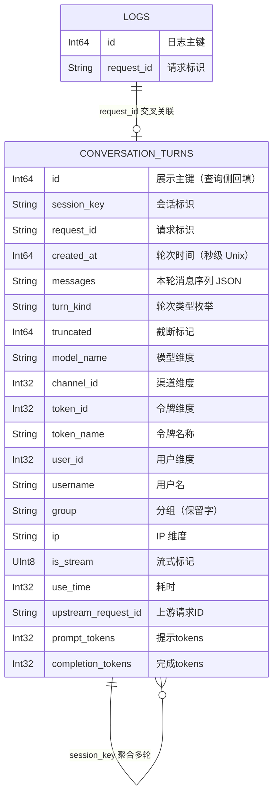

# 对话内容记录（ConversationLog）— 数据库模型设计文档

## 文档信息

| 项目 | 内容 |
|------|------|
| Feature | P1_TECH_001_TECH_对话内容记录 |
| 模块前缀 | `conversation` |
| 存储引擎 | ClickHouse（仅日志库 `LOG_SQL_DSN`） |
| 设计依据 | `01_功能需求规格说明书.md`（SSOT，§2.3 输出定义、§3.3 兼容性要求） |
| 规则文件 | `AGENTS_DATABASE_API_RULE.md`（项目根目录） |
| ORM/方言 | GORM v2 + ClickHouse 手写 DDL（仿 `model/main.go` 的 `clickHouseLogCreateTableSQL`） |

---

## ER图



**实体关系说明：**
- `conversation_turns`（轮次）与自身通过 `session_key` 聚合：同一 `session_key` 的多行构成一个多轮会话，会话内轮次顺序由 `ORDER BY created_at, request_id` 决定。
- `conversation_turns` 与 `logs`（计费日志）通过 `request_id` 交叉关联：logs 记计费摘要，conversation_turns 记对话明文，职责正交、不互相依赖。
- 全部关联通过业务字段实现，不建外键约束（规则文件 §1.5）。

---

## 表结构定义

### 1. 核心业务表：conversation_turns（日志库表）

**表名：** `conversation_turns`

**用途：** 一行一轮，记录一轮文本对话的请求侧增量与响应侧增量，按 `session_key` 聚合为完整多轮会话。不记 `quota`、不做计费运算，token 数仅来自响应 usage 解析。

**存储约束（SSOT §3.1、架构文档 §4.4）：** 仅落 ClickHouse 日志库（`LOG_SQL_DSN`），不落 SQLite/MySQL/PostgreSQL；开启 `CONVERSATION_LOG_ENABLED` 时必须配置 ClickHouse，未配置时功能不生效。

**DDL语句（ClickHouse，仿 `clickHouseLogCreateTableSQL`）：**

```sql
CREATE TABLE IF NOT EXISTS conversation_turns (
    id Int64 DEFAULT 0,
    session_key String DEFAULT '',
    request_id String DEFAULT '',
    created_at Int64 DEFAULT 0,
    messages String DEFAULT '',
    turn_kind String DEFAULT 'normal',
    truncated Int64 DEFAULT 0,
    model_name String DEFAULT '',
    channel_id Int32 DEFAULT 0,
    token_id Int32 DEFAULT 0,
    token_name String DEFAULT '',
    user_id Int32 DEFAULT 0,
    username String DEFAULT '',
    `group` String DEFAULT '',
    ip String DEFAULT '',
    is_stream UInt8 DEFAULT 0,
    use_time Int32 DEFAULT 0,
    upstream_request_id String DEFAULT '',
    prompt_tokens Int32 DEFAULT 0,
    completion_tokens Int32 DEFAULT 0
)
ENGINE = MergeTree()
PARTITION BY toYYYYMM(toDateTime(created_at))
ORDER BY (session_key, created_at, request_id)
TTL toDateTime(created_at) + INTERVAL 30 DAY DELETE
```

> `id Int64 DEFAULT 0`：ClickHouse 无自增，展示用 id 由查询侧按序回填（仿 `assignDisplayLogIds`），轮次唯一标识以 `request_id` 为准。
> `group` 为保留字，按 `logGroupCol` 方言约定用反引号包裹（规则文件 §1.4、SSOT §3.3）。
> `TTL` 周期复用 `LOG_SQL_CLICKHOUSE_TTL_DAYS`，示例为 30 天。

---

**字段说明：**

| 字段名 | 类型（ClickHouse） | 必填 | 默认值 | 说明 |
|--------|------|--------|--------|------|
| id | Int64 | 是 | 0 | 展示用主键；ClickHouse 无自增，查询侧按序回填，轮次唯一标识以 request_id 为准 |
| session_key | String | 是 | '' | 会话标识，`common.NewRequestId()` 风格；同会话多轮共享，聚合键 |
| request_id | String | 是 | '' | 请求标识，与 logs 表交叉分析的关联键 |
| created_at | Int64 | 是 | 0 | 轮次时间，Unix 秒级时间戳（`common.GetTimestamp()`）；分区与排序键（规则文件 §1.7） |
| messages | String | 是 | '' | 本轮完整消息序列 `[]MsgPart{role,kind,text}` 的 JSON 序列化，经 `common.Marshal` 写入；请求侧增量在前、响应侧在后（规则文件 §1.5 禁止 JSON 列，用 String 承载） |
| turn_kind | String | 是 | 'normal' | 轮次类型，枚举：turn_kind（first/normal/tool_round），tool_round 优先级最高 |
| truncated | Int64 | 是 | 0 | 0 表示未截断，大于 0 为截断字节数；响应体超 256KB buffer 上限时置位 |
| model_name | String | 否 | '' | 模型名称维度字段，从 context/请求取得 |
| channel_id | Int32 | 否 | 0 | 渠道 ID 维度字段 |
| token_id | Int32 | 否 | 0 | 令牌 ID 维度字段 |
| token_name | String | 否 | '' | 令牌名称维度字段；token 明文 key 不落库，仅存名称（SSOT §3.4） |
| user_id | Int32 | 否 | 0 | 用户 ID 维度字段 |
| username | String | 否 | '' | 用户名维度字段，从 context 直接取 |
| `group` | String | 否 | '' | 用户分组维度字段；保留字按 `logGroupCol` 方言约定处理列名（ClickHouse 反引号） |
| ip | String | 否 | '' | 客户端 IP 维度字段 |
| is_stream | UInt8 | 否 | 0 | 是否流式请求（0/1），ClickHouse 布尔用 UInt8（规则文件 §1.5） |
| use_time | Int32 | 否 | 0 | 请求耗时（秒），middleware 计时 |
| upstream_request_id | String | 否 | '' | 上游请求 ID 维度字段 |
| prompt_tokens | Int32 | 否 | 0 | 提示 tokens，唯一来源为响应 usage 解析（`parseUsage`），不查 logs、不做计费运算 |
| completion_tokens | Int32 | 否 | 0 | 完成 tokens，来自响应 usage；流式未带 `include_usage` 时记 0 |

> 类型列仅提供 ClickHouse：本表存储仅 ClickHouse（规则文件 §1.1），SQLite/MySQL/PostgreSQL 不承载 `conversation_turns`（SSOT §3.3）。
> 字段长度说明：本项目日志库表统一使用 ClickHouse `String` 类型承载文本（对齐 `logs` 表 DDL），不设 VARCHAR 长度（规则文件 §1.6 文本域场景）；`[长度来源：需求规格说明书 §2.3 + 日志库 String 约定]`。

---

**索引说明：**

| 索引名 | 类型 | 字段 | 用途 |
|--------|------|------|------|
| 主键排序键 | ORDER BY（MergeTree 主键） | `(session_key, created_at, request_id)` | 会话聚合查询（按 session_key）与轮次时间序排序（created_at, request_id）的存储主键，会话详情按序扫描高效 |
| 分区键 | PARTITION BY | `toYYYYMM(toDateTime(created_at))` | 按月分区，配合 TTL 自动清理过期分区数据 |
| 数据保留 | TTL | `toDateTime(created_at)` | 保留周期复用 `LOG_SQL_CLICKHOUSE_TTL_DAYS`，启动迁移时经 `ALTER TABLE ... MODIFY TTL` 动态对齐配置（与 logs 同源同路径） |

**业务规则/使用场景：**

- 一行一轮，写入路径不维护 `turn_seq` 自增；轮次顺序交由查询侧 `ORDER BY created_at, request_id` 决定，规避「读当前最大值加一」竞态与每次写入额外查询。
- 秒级 `created_at` 无法稳定区分同一会话同一秒内并发的多轮，`(created_at, request_id)` 双键排序是必要设计（SSOT §3.3）。
- 跨库聚合约束：SELECT 中 `session_key` 之外的维度列必须用聚合函数包裹（ClickHouse 用 `any()`），禁止裸返回非聚合列；首末轮时间与轮数是时间窗口内轮次的统计，非会话全量统计。
- 本表不记 `quota`、不做计费运算；计费信息归 logs 表，按 `request_id` 交叉关联。
- 失败/错误响应（4xx/5xx）同样入库：request 侧消息按请求体解析保留，assistant 侧解析失败记空、usage 失败记 0，缺失维度记零值。
- 建表迁移：`migrateClickHouseLogDB` 启动时建表（`CREATE TABLE IF NOT EXISTS` 幂等），与 logs 同路径同时机；TTL 经 `syncClickHouseTTL` 动态对齐 `LOG_SQL_CLICKHOUSE_TTL_DAYS`。

---

## 字典数据说明

`turn_kind` 为代码枚举（规则文件 §1.8：本项目不使用 `system_dict_type` / `system_dict_data` 字典表，枚举在代码中定义命名常量），因此不生成字典 INSERT 语句。

| 枚举字段 | 取值 | 说明 |
|---------|------|------|
| turn_kind | `first` | 新建会话首轮 |
| turn_kind | `normal` | 常规轮 |
| turn_kind | `tool_round` | 含工具调用的轮（优先于 first/normal，优先级最高） |

判定规则：含工具调用的轮记 `tool_round`；否则新建会话首轮记 `first`，其余轮记 `normal`。

---

## 缓存层设计（Redis）

会话指纹到 `sessionKey` 的短期映射缓存，多实例共享（SSOT §3.5、架构文档 §2.4）。

**缓存键设计：**

| 键 | 值 | TTL | 说明 |
|----|-----|-----|------|
| `conv:session:{token_id}:{prefixHash}` | sessionKey | 30min | 按 token_id 分桶 + 内容前缀哈希的会话指纹，映射到会话标识 |

**缓存更新策略（Cache-Aside + 原子抢占）：**

- 未命中：生成新 `sessionKey`，`RedisSetNX`（SET NX EX，原子）抢占；胜出者使用自己的 sessionKey，失败者 `RedisGet` 重读已存在的 sessionKey，消除同一会话首批请求并发劈会话窗口。
- 命中：复用 sessionKey 并滚动续期 TTL（`RedisExpire`），活跃会话不断链。
- Redis 未配置（`!common.RedisEnabled`）：退化为进程内 map 单实例模式，`common.SysError` 输出「单实例模式」标注。
- Redis 运行期故障：捕获链路不中断，本轮按新建会话回退生成 sessionKey，故障期间会话续链失效，恢复后自动回到 Redis 模式。

> 键前缀 `conv:session:` 遵循「前缀:业务键」缓存键命名规范（模板性能优化章节）。

---

## 索引策略

- ClickHouse MergeTree 以 `ORDER BY` 字段作为主键（排序键），本表主键为 `(session_key, created_at, request_id)`，覆盖会话列表聚合与详情取行的主查询路径。
- 按月分区（`toYYYYMM(toDateTime(created_at))`），支持时间范围查询的局部扫描与 TTL 清理。
- 首版不设二级索引（跳数索引）；如后续出现高频按 `request_id` 反查需求，可补充 `INDEX idx_request_id request_id TYPE minmax GRANULARITY 4`（SSOT 未要求，留作扩展）。

## 分表分库策略

- 本表不水平分表：日志库（`LOG_SQL_DSN`）独立于主库物理隔离，ClickHouse 天然支持大数据量列式存储。
- 分区策略即时间分区：按月分区，配合 `LOG_SQL_CLICKHOUSE_TTL_DAYS` 自动清理过期数据。
- 水平扩展：日志库可独立扩展为 ClickHouse 集群（架构文档 §4.3），应用层无感知。

---

## 性能优化

| 项 | 策略 | 说明 |
|----|------|------|
| 分区 | `PARTITION BY toYYYYMM(toDateTime(created_at))` | 按月分区，时间序查询局部扫描 |
| 数据保留 | TTL 复用 `LOG_SQL_CLICKHOUSE_TTL_DAYS` | 自动清理，无需定期任务删除 |
| 大字段 | `messages` 单列存序列化 JSON | 查询侧按需解码，列表接口不读该列 |
| 异步写库 | `gopool.Go` 编排 | 写库不阻塞响应路径，闭包只捕获纯值 |
| 捕获开销 | 256KB buffer 上限 | 超限截断置 `truncated`，内存占用有界 |
| 会话缓存 | Redis + 进程内 map | 命中即复用 sessionKey，避免会话识别查询开销 |

## 安全措施

- token 明文 key 不落库，仅存 `token_name`；管理员按名称查询（与 logs 表惯例一致）。
- 会话详情不回传 `ip` / `channel_id` / `token_id` / `use_time` 等整表维度字段（SSOT §3.4）。
- 无外键约束，关联完整性由应用层保证（规则文件 §1.5）。
- 表仅存日志库，与主库业务数据物理隔离（架构文档 §2.2）。

## 其他设计

| 项 | 设计 | 说明 |
|----|------|------|
| 幂等性 | `migrateClickHouseLogDB` 启动迁移 `CREATE TABLE IF NOT EXISTS` | 与 logs 同路径，启动建表幂等，配置变更重启重新对齐 TTL |
| 并发控制 | `RedisSetNX` 原子抢占 | 消除同会话首批请求并发劈会话窗口 |
| 会话续链 | Redis 状态，TTL 30min 滚动续期 | 网关重启不断链（TTL 内续得上），多副本跨实例续上同一会话 |
| 一致性 | 最终一致 | 异步写库，查询侧按 `created_at, request_id` 排序聚合 |
| 数据迁移 | 新表，无存量迁移 | ClickHouse TTL 自动清理，无需手工归档 |
| 方言兼容 | 仅 ClickHouse 手写 DDL | 本表不落三主库（SSOT §3.3），无需 SQLite/MySQL/PostgreSQL 回退分支 |
