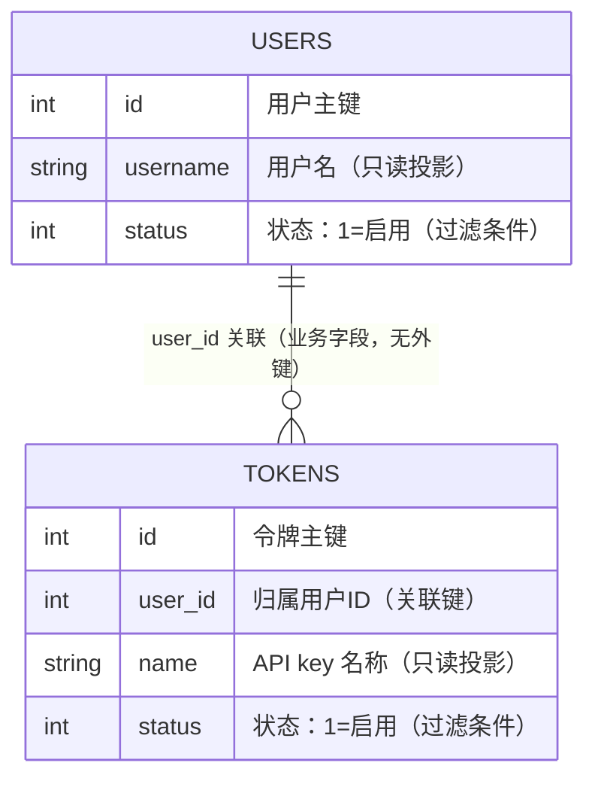

# 用户信息字典查询（ConversationLog 变更）— 数据库模型设计文档

## 文档信息

| 项目 | 内容 |
|------|------|
| Feature | P1_TECH_002_RFC_用户信息接口 |
| 基线 Feature | P1_TECH_001_TECH_对话内容记录 |
| 模块前缀 | `conversation` |
| 存储引擎 | 主库（`SQL_DSN`，SQLite/MySQL/PostgreSQL）既有 `users`/`tokens` 表，只读 SELECT |
| 设计依据 | `01_功能需求规格说明书.md`（SSOT，§2.3 输出定义、§2.4 能力8、§3.1 数据库兼容性、§3.2 安全要求） |
| 规则文件 | `AGENTS_DATABASE_API_RULE.md`（项目根目录） |
| ORM/方言 | GORM v2（`Where`/`Find`/分页方法，三库兼容，无方言专用 SQL） |

**重要声明：** 本次变更**不新增任何表、不改任何 DDL、不做数据迁移**。仅对主库现有的 `users`/`tokens` 表做只读 SELECT 投影，并在 Go 内存中按用户聚合为响应 DTO。无新增字典数据（`status` 为既有 int 枚举），无 Redis 缓存（名称随编辑变更，每次查主库）。

---

## ER图



**实体关系说明：**

- `tokens.user_id` 指向 `users.id`，一个用户对应零到多个令牌，构成一对多关系。
- 关联仅通过业务字段 `user_id` 实现，**无外键约束**（规则文件 §1.5：禁止 `FOREIGN KEY`/`REFERENCES`，表关联仅通过业务字段实现）。
- 本接口的查询为 LEFT JOIN 语义：以 `users` 为左表，只要 `users.status=1` 即返回该用户；名下无启用 token 时 `tokens` 为空数组。

---

## 数据来源（只读投影，无新增表）

以下两张表均为**主库既有表**，由项目既有 GORM 模型定义（`model/user.go`、`model/token.go`），本 RFC **不修改其任何字段、索引与约束**，仅做只读 SELECT 投影。下方字段说明仅列出本接口实际读取的列与过滤条件列。

### 1. 数据来源表：users（主库既有表，只读）

**表名：** `users`

**用途（本接口视角）：** 提供启用用户的 `id` 与 `username`，作为字典聚合行的主体。本接口只读 `id`/`username`/`status` 三列，过滤 `status=1`，软删除由 GORM 自动过滤。

**字段说明（本接口只读投影）：**

| 字段名 | 类型（GORM） | 必填 | 默认值 | 说明 |
|--------|------|--------|--------|------|
| id | int | 是 | GORM 自动生成 | 用户主键，响应中的 `user_id`，聚合与排序键；BIGINT 由 GORM 自动生成（规则文件 §1.2 禁止手工 AUTO_INCREMENT/SERIAL） |
| username | string | 是 | — | 用户名，响应中的 `username`；既有 GORM 模型 `validate:"max=20"`，`gorm:"unique;index"`，长度上限 20（`[长度来源：既有 User 模型 validate tag]`） |
| status | int | 是 | 1 | 用户状态，本接口过滤条件 `status=1`（启用）；既有 GORM 模型 `gorm:"type:int;default:1"`，枚举：1=启用、其余=禁用 |

> 类型说明：`users` 为三库兼容的主库表（SQLite/MySQL/PostgreSQL），列类型由既有 GORM 模型推导，本 RFC 不改动。完整字段定义见 `model/user.go` 的 `User` 结构体（含 Password/Email/Quota 等敏感字段，本接口一律不读取、不返回）。

**索引说明（既有索引，本接口受益）：**

| 索引名 | 类型 | 字段 | 用途 |
|--------|------|------|------|
| 主键 | PRIMARY | `id` | 按 `user_id` 升序分页扫描的主键顺序 |
| idx_users_username | UNIQUE | `username` | `username` LIKE 过滤可走索引前缀（LIKE 前缀匹配场景） |
| idx_users_deleted_at | INDEX | `deleted_at` | GORM 软删除自动追加 `deleted_at IS NULL` 过滤 |

---

### 2. 数据来源表：tokens（主库既有表，只读）

**表名：** `tokens`

**用途（本接口视角）：** 提供启用 token 的 `id`、`user_id`、`name`，作为字典中名下 API key 名称维度。本接口只读 `id`/`user_id`/`name`/`status` 四列，过滤 `status=1`，软删除由 GORM 自动过滤。

**字段说明（本接口只读投影）：**

| 字段名 | 类型（GORM） | 必填 | 默认值 | 说明 |
|--------|------|--------|--------|------|
| id | int | 是 | GORM 自动生成 | 令牌主键，响应中的 `token_id`，名下 token 排序键 |
| user_id | int | 是 | — | 归属用户 ID，关联 `users.id` 的业务字段；既有 GORM 模型 `gorm:"index"` |
| name | string | 否 | — | API key 名称，响应中的 `token_name`；既有 GORM 模型 `gorm:"index"`，key 明文（`key` 列）一律不读取、不返回（SSOT §3.2） |
| status | int | 是 | 1 | 令牌状态，本接口过滤条件 `status=1`（启用）；既有 GORM 模型 `gorm:"default:1"`，枚举：1=启用、其余=禁用 |

> 类型说明：`tokens` 为三库兼容的主库表，列类型由既有 GORM 模型推导，本 RFC 不改动。完整字段定义见 `model/token.go` 的 `Token` 结构体（含 key 明文、配额、过期时间等敏感字段，本接口一律不读取、不返回）。

**索引说明（既有索引，本接口受益）：**

| 索引名 | 类型 | 字段 | 用途 |
|--------|------|------|------|
| 主键 | PRIMARY | `id` | 按 `token_id` 升序排序 |
| idx_tokens_user_id | INDEX | `user_id` | 按用户批量取名下 token 的关联扫描 |
| idx_tokens_name | INDEX | `name` | `token_name`（映射 `tokens.name`）LIKE 过滤 |
| idx_tokens_deleted_at | INDEX | `deleted_at` | GORM 软删除自动追加 `deleted_at IS NULL` 过滤 |

---

## 聚合响应结构（DTO，非持久化）

以下三个结构体定义于 `model/conversation.go`，为**非持久化的内存聚合 DTO**，不对应任何数据库表。字段名、类型、JSON tag 严格遵循 SSOT §2.3。

### ConversationToken

用户名下单个 API key 的精简信息，仅名称维度。

```go
type ConversationToken struct {
    TokenID   int    `json:"token_id"`
    TokenName string `json:"token_name"`
}
```

| 字段名 | Go 类型 | JSON 字段 | 来源列 | 说明 |
|--------|---------|-----------|--------|------|
| TokenID | int | `token_id` | `tokens.id` | API key（令牌）ID |
| TokenName | string | `token_name` | `tokens.name` | API key 名称；key 明文（`tokens.key`）不进入响应 |

### ConversationUserSummary

用户信息字典聚合行，按用户聚合。

```go
type ConversationUserSummary struct {
    UserID   int                 `json:"user_id"`
    Username string              `json:"username"`
    Tokens   []ConversationToken `json:"tokens"`
}
```

| 字段名 | Go 类型 | JSON 字段 | 来源列 | 说明 |
|--------|---------|-----------|--------|------|
| UserID | int | `user_id` | `users.id` | 用户 ID |
| Username | string | `username` | `users.username` | 用户名 |
| Tokens | []ConversationToken | `tokens` | `tokens.*` 聚合 | 名下启用 token 数组，按 `token_id` 升序；名下无启用 token 时为空数组（非 nil） |

### ConversationUserQueryParams

用户信息字典过滤维度（无 JSON tag，仅作内部参数传递）。

```go
type ConversationUserQueryParams struct {
    Username  string
    TokenName string
}
```

| 字段名 | Go 类型 | 映射 | 说明 |
|--------|---------|------|------|
| Username | string | `users.username LIKE '%x%'` | 用户名包含匹配，空串表示不过滤 |
| TokenName | string | `tokens.name LIKE '%x%'` | API key 名称包含匹配，作用于用户名下 token 维度，空串表示不过滤 |

---

## 查询设计

### 查询函数签名（SSOT §2.4）

```go
// ListConversationUsers 按用户聚合分页返回启用状态用户的 username 与名下启用 token_name。
// users.status=1 且未软删除；tokens.status=1 且未软删除（GORM 自动过滤 DeletedAt）。
// username 模糊过滤用户；token_name 模糊过滤用户名下的 token，仅保留至少含一个匹配 token 的用户。
// 按 user_id 升序分页。返回 ([]ConversationUserSummary, int64, error)，
// int64 为满足条件的用户总数（controller 分页 PageInfo 需要）。
func ListConversationUsers(params *ConversationUserQueryParams, page, pageSize int) ([]ConversationUserSummary, int64, error)
```

### LEFT JOIN 逻辑模型

```
users (status=1, 未软删除)
  LEFT JOIN tokens (status=1, 未软删除, user_id = users.id)
  GROUP BY users.id
```

逻辑语义分两种过滤组合：

- `token_name` 未指定：以启用用户（`status=1`，`username` 可选过滤）为左表，左连接其名下全部启用 token；只要用户启用即返回一行，名下无启用 token 时 `tokens` 为空数组（LEFT JOIN 空数组语义）。
- `token_name` 指定：用户集合进一步收口为「名下至少含一个匹配启用 token」，连接侧只保留匹配 token；此分支返回用户必有非空 `tokens`，空数组分支不触发。

两种组合的 `total` 与分页均以收口后的用户集合为准（见下方「GORM 实现方案」步骤 1）。

### GORM 实现方案（两段式，三库兼容）

为兼顾三库兼容与分页一致性，采用「先分页取用户、再批量取名下 token、Go 内存聚合」的两段式实现，结果与 LEFT JOIN 逻辑模型等价。关键点：`token_name` 对用户的资格收口必须在分页前完成，否则 `total` 与本页条数会因事后丢弃无匹配 token 的用户而失真。

1. **用户分页查询（含 token_name 资格收口）**：`DB.Model(&User{}).Where("status = ?", 1)`，可选 `.Where("username LIKE ?", "%"+params.Username+"%")`；当 `token_name` 指定时，追加 `.Where("id IN (?)", DB.Model(&Token{}).Select("user_id").Where("status = ?", 1).Where("name LIKE ?", "%"+params.TokenName+"%"))`，将用户集合收口为「名下至少含一个匹配启用 token 的用户」。`.Count(&total)` 取该集合总数（`PageInfo.total`），再 `.Order("id asc").Limit(pageSize).Offset((page-1)*pageSize)` 取本页用户 `id`/`username`。
2. **令牌批量查询**：对本页用户 ID 集合，`DB.Model(&Token{}).Where("user_id IN ?", userIDs).Where("status = ?", 1)`；当 `token_name` 指定时追加 `.Where("name LIKE ?", "%"+params.TokenName+"%")`（仅返回匹配 token），`.Order("user_id asc, id asc")` 取 `id`/`user_id`/`name`。
3. **内存聚合**：本页每个用户的 `tokens` 初始化为空数组，将步骤 2 的令牌按 `user_id` 分组挂到对应用户，按 `user_id` 升序组装为 `[]ConversationUserSummary`，每用户 `tokens` 按 `token_id` 升序。
4. **LEFT JOIN 空数组语义的分界**：`token_name` 未指定时，步骤 1 不收口用户、步骤 2 取名下全部启用 token，名下无启用 token 的用户仍返回且 `tokens` 为空数组，对应 SSOT 的 LEFT JOIN 语义；`token_name` 指定时，步骤 1 已将用户收口为「至少含一个匹配 token」，返回用户必有非空 `tokens`，空数组分支不触发。两分支统一由「初始化空数组 + 按需挂载」自然实现。

**三库兼容性（SSOT §3.1、规则文件 §1.1）：** 全程使用 GORM 方法（`Where`/`Find`/`Count`/`Order`/`Limit`/`Offset` 与 `id IN (子查询)`），不写原生 SQL、不使用任何方言专用语法；`deleted_at IS NULL` 由 GORM 对 `User`/`Token` 两张子查询自动追加；`LIKE` 大小写敏感度按各数据库默认排序规则（SSOT §2.2 已约定）；`IN (SELECT ...)` 子查询在 SQLite/MySQL/PostgreSQL 行为一致。

> 两段式而非单条 LEFT JOIN + GROUP BY 的取舍：分页以用户为单位时，单条 SQL 的 `GROUP BY users.id` 配合 `LIMIT/OFFSET` 在三库下聚合与计数的写法分歧较大（SQLite/MySQL/PostgreSQL 对 GROUP BY 计数与 `ANY_VALUE` 语义不一致）；两段式将聚合下沉到 Go 内存，查询为最朴素的 `Where`+`IN`+`Order`，三库行为完全一致，且 `user_id IN (...)` 与子查询内的 `user_id`/`name` 均命中既有索引（`idx_tokens_user_id`、`idx_tokens_name`）。`token_name` 资格经子查询在分页前收口，保证 `total` 与本页用户集合一致，避免「分页后丢弃」导致的空页与计数偏差。

### 字段最小化映射

| 响应字段 | 来源表.列 | 进入响应 | 说明 |
|----------|-----------|----------|------|
| `user_id` | `users.id` | 是 | — |
| `username` | `users.username` | 是 | — |
| `token_id` | `tokens.id` | 是 | — |
| `token_name` | `tokens.name` | 是 | — |
| `tokens.key`（API key 明文） | `tokens.key` | **否** | 一律不读取、不返回 |
| `users.password`/`email`/`access_token`/`quota`/`used_quota` 等 | `users.*` | **否** | 一律不读取、不返回 |

查询与 DTO 结构体均不声明上述敏感列，从结构上保证不泄露（SSOT §3.2）。

---

## 字典数据说明

本次变更**不生成字典 INSERT 语句**。涉及的 `status` 字段为既有 `users`/`tokens` 表的 int 枚举（规则文件 §1.8：本项目不使用 `system_dict_type`/`system_dict_data` 字典表，枚举在代码中定义命名常量）。

| 枚举字段 | 取值 | 说明 |
|---------|------|------|
| users.status | `1` | 启用（本接口仅返回） |
| users.status | 非 1（如 2） | 禁用（本接口过滤排除） |
| tokens.status | `1` | 启用（本接口仅返回名下启用 token） |
| tokens.status | 非 1（如 2） | 禁用（本接口过滤排除） |

> 枚举具体禁用值沿用项目既有约定，本 RFC 不重新定义。

---

## 缓存层设计

**不引入缓存。** 用户名与 API key 名称可能随用户/令牌编辑随时变更，缓存会导致字典与实际维度脱节。每次请求直接查主库（SSOT §2.4）。查询开销与用户/token 规模成正比，外部平台按需低频调用，无需 Redis 会话缓存（与基线会话续链的 Redis 多槽缓存无关，不复用）。

---

## 索引策略

本接口不新增索引，复用既有 `users`/`tokens` 表索引：

- `users` 主键顺序支撑按 `user_id` 升序分页；`username` 唯一索引支撑 `username` LIKE 前缀匹配；`deleted_at` 索引支撑软删除过滤。
- `tokens.user_id` 索引支撑「按用户 ID 集合批量取名下 token」的主查询路径；`name` 索引支撑 `token_name` LIKE 过滤。

如后续出现按 `token_name` 全量反查的高频场景，既有 `idx_tokens_name` 已足够，无需新增。

---

## 分表分库策略

本接口**不涉及分表分库**：

- `users`/`tokens` 为三库兼容的主库业务表，本接口只读访问主库 `DB`（非日志库 `LOG_DB`），与 ClickHouse 日志存储无关。
- 不做水平分表、不做时间分区，主库扩展策略沿用项目既有约定。

---

## 安全措施

- **字段最小化**：响应仅含 `user_id`/`username`/`token_id`/`token_name`；`tokens.key`（API key 明文）、`users.password`/`email`/`access_token`、配额与用量字段一律不读取、不返回（SSOT §3.2）。
- **只读**：接口仅 SELECT，不修改 `users`/`tokens` 数据。
- **软删除过滤**：`users`/`tokens` 的 `DeletedAt` 由 GORM 自动过滤，软删除记录不进入结果。
- **访问控制**：复用 `middleware.ConversationLogAuth()` 集成密钥认证，错误码与会话列表/详情一致（403 `CONVERSATION_LOG_KEY_NOT_CONFIGURED` / 401 `CONVERSATION_LOG_INVALID_KEY`）。

---

## 其他设计

| 项 | 设计 | 说明 |
|----|------|------|
| 新增表 | 无 | 本次变更不新增任何表 |
| 表结构迁移 | 无 | 不改 `users`/`tokens` 任何列定义、索引、约束；零 DDL、零迁移脚本，存量数据无需处理 |
| 幂等建表 | 无 | 既无新表，无 `CREATE TABLE`/`AutoMigrate` 动作 |
| 字典数据 | 无 | `status` 为既有 int 枚举，不生成字典 INSERT |
| Redis 缓存 | 无 | 名称随编辑变更，每次查主库 |
| 并发控制 | 无 | 纯只读查询，无写竞争，无需行锁 |
| 一致性 | 强一致（读主库） | 直接读主库当前状态，无异步写入延迟 |
| 方言兼容 | GORM 方法三库兼容 | 全程 `Where`/`Find`/`Count`/`Order`/`Limit`/`Offset`，无原生 SQL、无方言专用语法（规则文件 §1.1） |
