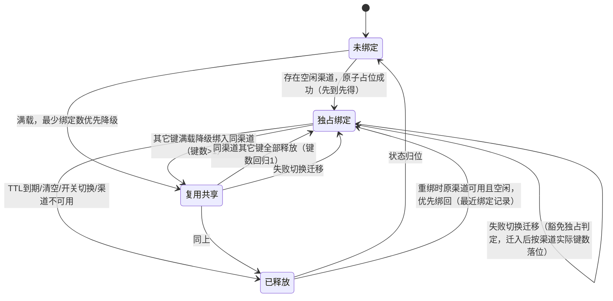

# 渠道独占绑定 数据模型设计文档

## 文档信息

| 项目 | 内容 |
|------|------|
| Feature ID | P2_CHL_001_FEAT_渠道独占绑定 |
| 模块前缀 | chl_affinity（复用现有渠道亲和性数据体系） |
| 文档版本 | v1.0 |
| 创建日期 | 2026-08-31 |
| 上游文档 | 01_功能需求规格说明书.md（SSOT）、AGENTS_DATABASE_API_RULE.md、context/03_architecture/architecture.md |

---

## 1. 设计概述

### 1.1 存储结论

本 Feature 新增的两项核心数据（反向占用索引、最近绑定记录）为运行时缓存数据，与现有正向亲和缓存同存储体系（cachex.HybridCache，Redis 优先、内存回退），随 TTL 自然失效，无持久化查询需求。降级审计为消费日志既有 `other` 列的 JSON 追加，降级计数为进程内计数器。

因此数据库层面仅有一处持久化变更：`options` 表中 `channel_affinity_setting.rules` 配置项的 JSON 值结构扩展 `exclusive_bind` 字段。无新增业务表、无新增列、无 DDL 变更、无字典数据。

### 1.2 数据分布总览

| 数据项 | 存储位置 | 变更类型 | 需求追溯 |
|-------|---------|---------|---------|
| 亲和规则（含 exclusive_bind） | 主库 `options` 表 `channel_affinity_setting.rules` 行（JSON 字符串） | JSON 结构扩展一个布尔字段 | SSOT 4.1.2 |
| 正向亲和缓存 | HybridCache 命名空间 `new-api:channel_affinity:v1` | 无变更 | SSOT 5.1.3 |
| 反向占用索引 | HybridCache 新命名空间 `new-api:channel_affinity_occupancy:v1` | 新增 | SSOT 5.2.3 |
| 最近绑定记录 | HybridCache 新命名空间 `new-api:channel_affinity_last_bind:v1` | 新增 | SSOT 5.1.3 |
| 降级审计标记 | 日志库 `logs` 表 `other` 列（admin_info.channel_affinity 追加） | JSON 内容追加，无列变更 | SSOT 5.3.3 |
| 降级计数器 | 进程内原子计数器 | 新增（无库表） | SSOT 5.3.3 |

---

## 2. ER 图

本 Feature 无新增实体与关系。相关既有实体关系如下：

```
options (channel_affinity_setting.rules 行)
    │ 1 : N（JSON 数组内嵌，非表关联）
    ▼
ChannelAffinityRule（含 exclusive_bind）──── 运行时读取 ────▶ 独占绑定选路引擎
                                                              │
                        ┌─────────────────────────────────────┼──────────────────────────┐
                        ▼                                     ▼                          ▼
              正向亲和缓存（键→渠道）              反向占用索引（渠道→键指纹集合）    最近绑定记录（键→渠道+时间戳）
              HybridCache / TTL 1 周期             HybridCache / TTL 1 周期（新增）    HybridCache / TTL 2 周期（新增）
                        │                                     │                          │
                        └────────────── 同批清空（管理员清缓存 / 独占开关切换）──────────┘

logs（日志库，other 列 JSON） ◀── 降级审计标记追加（admin_info.channel_affinity，非管理员视图剥离）
channels（主库） ◀── 业务字段 channel_id 关联（无外键约束，沿用规则文件 §1.5）
```

三套运行时缓存之间的键映射关系：正向缓存键（规则作用域+亲和键）与最近绑定记录键一一对应；反向占用索引以渠道 ID 为主键维度聚合正向下辖全部键的指纹。

---

## 3. 持久化数据模型

### 3.1 亲和规则结构（options 表 JSON 扩展）

**表名：** `options`（现有表，无 DDL 变更）

**用途：** 承载 `channel_affinity_setting.rules` 配置项。本 Feature 在该 JSON 数组元素结构中扩展 `exclusive_bind` 字段。

**结构定义（JSON Schema 视角，值经 `common.Marshal`/`common.Unmarshal` 读写）：**

```go
type ChannelAffinityRule struct {
    Name             string                     `json:"name"`
    ModelRegex       []string                   `json:"model_regex"`
    PathRegex        []string                   `json:"path_regex"`
    UserAgentInclude []string                   `json:"user_agent_include,omitempty"`
    KeySources       []ChannelAffinityKeySource `json:"key_sources"`
    ValueRegex       string                     `json:"value_regex"`
    TTLSeconds       int                        `json:"ttl_seconds"`
    ParamOverrideTemplate map[string]interface{} `json:"param_override_template,omitempty"`
    SkipRetryOnFailure bool                     `json:"skip_retry_on_failure"`
    IncludeUsingGroup bool                      `json:"include_using_group"`
    IncludeModelName  bool                      `json:"include_model_name"`
    IncludeRuleName   bool                      `json:"include_rule_name"`
    ExclusiveBind     bool                      `json:"exclusive_bind"` // 本 Feature 新增
}
```

**字段说明（新增字段）：**

| 字段名 | 类型 | 必填 | 默认值 | 说明 |
|--------|------|------|--------|------|
| exclusive_bind | bool | 否 | false | 规则级独占绑定开关。启用后该规则亲和绑定执行渠道独占语义：绑定前检查渠道占用，满载按最少绑定数优先降级复用 [需求：SSOT 4.1.2]。缺省按 false 反序列化，旧配置无感兼容 [长度来源：不适用，布尔字段] |

**存量字段说明（options 表本身，沿用现状，不重复展开）：**

| 字段名 | 类型（MySQL）| 类型（PostgreSQL）| 类型（SQLite）| 必填 | 默认值 | 说明 |
|--------|------|------|------|--------|--------|------|
| key | VARCHAR(255) | VARCHAR(255) | TEXT | 是 | - | 主键。配置键，本功能涉及值为 `channel_affinity_setting.rules` |
| value | TEXT | TEXT | TEXT | 是 | - | 配置值，本功能为规则数组 JSON 字符串 |

**索引说明：**

| 索引名 | 类型 | 字段 | 用途 |
|--------|------|------|------|
| PRIMARY | PRIMARY KEY | key | 按键读写配置 |

**业务规则：**

- 开关切换联动：保存的规则数组中任一规则 `exclusive_bind` 相对保存前值变化并保存成功时，同批清空该规则的正向亲和缓存、反向占用索引、最近绑定记录（SSOT 4.1.4 规则1）
- 三库兼容：options 表为现有表，本 Feature 无 DDL 变更，天然满足 SQLite / MySQL / PostgreSQL 兼容性要求（规则文件 §1.1）
- JSON 读写经 `common.Marshal` / `common.Unmarshal` 包装（规则文件 §1.1、AGENTS.md JSON 包规则）
- 布尔字段无 GORM default tag，缺省值在反序列化归一化层处理（规则文件 §1.5 布尔字段约束）

---

## 4. 运行时数据模型（HybridCache 命名空间设计）

运行时数据与正向亲和缓存同体系：Redis 启用时持久于 Redis（多实例共享，独占判定与先到先得跨实例生效）；未启用 Redis 时回退进程内内存（多实例间不可见，行为退化为现有软亲和，属已知限制，SSOT 5.2.2 第6条）。

### 4.1 反向占用索引（新增）

**命名空间：** `new-api:channel_affinity_occupancy:v1`

**用途：** 渠道 → 绑定键指纹集合的反向索引，为独占判定、最少绑定数选路、统计指标提供数据（SSOT 5.2.1）。

**条目结构：**

| 维度 | 设计 | 说明 |
|------|------|------|
| 键 | `{channel_id}`（渠道 ID 十进制字符串） | 以渠道为聚合维度 |
| 值 | 键指纹集合（string set，元素为 affinityFingerprint 输出，SHA1 前 16 位 hex；Redis 模式条目值为 JSON 序列化对象 `{"key_fps": [...]}`，经 occupancyAddScript 内 cjson 编解码） | 索引不存原始键值，避免敏感信息扩散 [需求：SSOT 5.2.3] |
| TTL | 与对应正向绑定一致（规则 TTL，缺省 DefaultTTLSeconds） | 条目内成员随正向绑定逐个登记，条目整体 TTL 按最近一次登记续期（SSOT 5.2.4 规则1） |

**成员过期滞后窗口（设计内边界）：** 条目为渠道级整体 TTL，成员无独立过期。某键的正向绑定过期后，其指纹残留于渠道条目直至条目整体过期。注意条目 TTL 按最近一次登记续期：持续有流量的活跃渠道上，残留成员的滞留无固定上界（其它成员的每次成功请求都会续期整条目），仅静默渠道上滞后窗口最长一个 TTL。窗口内独占判定偏保守（渠道看似被占用，可能诱发不必要的满载降级复用），统计口径偏高。该滞后方向保守，管理员按规则/整体清空可立即收敛，与 SSOT 5.2.2 第3条的粗粒度过期取向一致，不做成员级精确过期。

**字段说明：**

| 成员 | 类型 | 说明 |
|------|------|------|
| 渠道 ID（条目键） | string | 业务关联字段，指向 channels.id，无外键约束 |
| 键指纹（集合元素） | string，16 位 hex | 亲和键哈希截断标识 [需求：SSOT 8.1 键指纹、偏离 D5] |

**访问模式与索引说明（Redis 键设计）：**

| 操作 | 实现方式 | 用途 |
|------|---------|------|
| 独占判定 | 读渠道条目，键数为 0 或仅含本键指纹 → 空闲 | SSOT 5.1.2 第2条 |
| 满载降级选路 | 遍历候选渠道条目取绑定键数，最少者优先 | SSOT 5.1.2 第2条 |
| 统计 | 遍历全部条目，键数 1 计独占、大于 1 计复用 | SSOT 4.2.4 规则1 |
| 登记/移除 | 集合成员增删，与正向绑定写入/清除同批 | SSOT 5.2.2 第1、2条 |

Redis 模式下**登记**（acquire 胜者、RecordChannelAffinity 续期、迁移迁入等全部登记路径）经 Lua 脚本原子完成"读条目→增成员→写回（SET PX 续期）"（occupancyAddScript），与正向绑定的原子写入配合实现先到先得，且登记并发不再丢失其它实例的成员写入；**移除**（迁移/回滚/清空）同样经 Lua 脚本原子完成"读条目→删成员→空则 DEL / 按剩余 TTL（PTTL，不续期）写回"（occupancyRemoveScript），成员不在条目内时幂等 no-op：移除的读改写若为裸 GET→SET，回写会覆盖并发登记/占位脚本刚追加的成员，成员丢失使占用被低估、独占误判空闲（v1.7 修复，生产缺陷回路验证）；条目值与内存模式同构（JSON 序列化的键指纹集合，经 cachex.JSONCodec 读写），保持与正向缓存同一 HybridCache 体系、三命名空间统一清空路径。内存回退模式用带分段锁的进程内 map[string]map[string]struct{} 实现（HybridCache 内存侧为条目级 SET/GET/DEL，成员进出在值内完成），单实例内串行化满足先到先得（SSOT 5.1.2 第2条末）。

**业务规则：**

- 所有亲和规则（无论是否启用独占）的绑定均登记本索引；仅启用独占的规则在绑定时检查索引执行独占判定（SSOT 5.2.4 规则1）
- 索引读写失败时请求不阻塞，降级为现有软亲和，记 SysError 含渠道与键指纹（SSOT 5.1.5）
- 本键既有绑定视为空闲（SSOT 5.1.2 第2条）
- 独占判定以渠道为单位全局生效，跨规则（SSOT 5.1.4 规则1）

### 4.2 最近绑定记录（新增）

**命名空间：** `new-api:channel_affinity_last_bind:v1`

**用途：** 亲和键 → 最近一次绑定渠道 + 绑定时间戳，TTL 过期重绑时优先绑回原渠道的依据（SSOT 5.1.3）。

**条目结构：**

| 维度 | 设计 | 说明 |
|------|------|------|
| 键 | 与正向亲和缓存键一致（规则作用域构成 + 亲和键，即正向键去掉正向命名空间前缀） | 与正向绑定一一对应，迁移/清除时按键同步 |
| 值 | JSON：`{channel_id: int, bound_at: int64}`，经 cachex.JSONCodec（HybridCache 内建编解码，与正向缓存同体系）序列化 | channel_id 业务关联 channels.id，无外键；bound_at 为 Unix 秒级时间戳（`common.GetTimestamp()`） |
| TTL | 正向绑定两个周期（2 × 规则 TTL） | 条目在正向绑定过期后再保留一个 TTL 周期，到期自动清除（SSOT 5.1.3、5.2.2 第3条） |

**字段说明：**

| 字段名 | 类型 | 必填 | 说明 |
|--------|------|------|------|
| channel_id | int | 是 | 最近一次绑定的渠道 ID，业务关联字段 [需求：SSOT 5.1.3] |
| bound_at | int64 | 是 | 最近一次绑定写入时间，Unix 秒级时间戳（规则文件 §1.7） [需求：SSOT 5.1.3] |

**业务规则：**

- 随正向绑定写入时同步写入；失败切换迁移时同步更新为新渠道（SSOT 5.2.2 第1、2条）
- 重绑优先级：TTL 到期重绑时，原渠道仍可用且空闲则优先绑回；否则走正常独占选路（SSOT 5.1.4 规则4）
- 清除时机：管理员清空缓存（全部/按规则）、独占开关切换保存、请求终态失败回滚、渠道不可用清缓存（keep_on_channel_disabled=false 语义）时，与正向缓存同批清除（SSOT 5.1.2 第4条、5.2.2 第4条）

### 4.3 降级审计标记（消费日志 other 列 JSON 追加）

**载体：** 日志库 `logs` 表 `other` 列（现有 TEXT 列，无 DDL 变更），追加路径 `other.admin_info.channel_affinity.exclusive_degrade`。

**用途：** 满载复用降级事件留痕，仅管理员可见（非管理员日志视图剥离 admin_info，现有机制）。

**标记结构：**

```json
{
  "rule_name": "claude cli trace",
  "key_fp": "a1b2c3d4e5f60718",
  "channel_id": 42,
  "channel_binding_count": 3
}
```

**字段说明：**

| 字段名 | 类型 | 必填 | 说明 |
|--------|------|------|------|
| rule_name | string | 是 | 触发降级的亲和规则名 [需求：SSOT 5.3.2 第1条] |
| key_fp | string | 是 | 亲和键指纹（16 位 hex），不存原始键值 [需求：SSOT 5.3.3，偏离 D5] |
| channel_id | int | 是 | 降级复用目标渠道 ID，业务关联字段 [需求：SSOT 5.3.2 第1条] |
| channel_binding_count | int | 是 | 该渠道降级发生时的绑定键数 [需求：SSOT 5.3.2 第1条] |

**业务规则：**

- 审计不改变请求正常响应与计费，仅追加日志信息（SSOT 5.3.4 规则1）
- 写入失败静默跳过，记服务端错误日志（SSOT 5.3.5）
- JSON 序列化经消费日志 other 列现有链路（`common.MapToJsonStr`，规则文件 §1.1 的既有包装路径）

---

## 5. 数据状态机（运行时绑定状态）

状态主体为某亲和键与某渠道的绑定关系，落点在上述三套运行时数据（SSOT 6.1、6.2）：



状态判定依据与存储对应：未绑定/已释放为无正向缓存条目；独占绑定/复用共享由反向占用索引中该渠道的键数区分（1 为独占，大于 1 为复用，SSOT 6.1）。

---

## 6. 一致性与并发设计

### 6.1 原子性与先到先得（SSOT 5.1.2、5.1.4 规则2）

| 部署形态 | 机制 | 语义保证 |
|---------|------|---------|
| 单实例（内存模式） | 按亲和键哈希分段锁（参考现有 channelAffinityUsageCacheStatsLocks 模式），绑定决策与占位写入临界区内串行；独占占位经 occupancyClaimExclusive 在渠道条目分段锁内完成读-判-写（v1.6） | 同键并发首次绑定，首个完成占位者生效，其余读胜者结果；跨键并发对同一渠道的条件占位互斥，独占模式无静默双占 |
| 多实例（Redis 模式） | 正向绑定写入与反向索引登记经 Lua 脚本/SetNX 原子执行（索引移除同样经 occupancyRemoveScript Lua 原子执行，见 4.1）；独占占位经 occupancyClaimExclusiveScript Lua 原子判定：条目空或仅含本键指纹才登记，否则返回冲突与持有键数供决策方剔除重选（v1.6） | 跨实例先到先得，占位写入原子生效；跨实例跨键的独占条件占位同样原子，冲突方转入满载降级（带标记）；移除与登记并发不丢失成员 |

### 6.2 同批清理一致性（SSOT 5.2.4 规则2）

清空操作（管理员清空、按规则清空、开关切换、终态失败回滚、渠道不可用清除）必须对正向缓存、反向占用索引、最近绑定记录三批同批执行。清理失败的重试与降级路径见接口文档第 5 节，残留条目随 TTL 自然过期兜底（SSOT 5.1.5）。

### 6.3 容量与淘汰

- 反向占用索引、最近绑定记录与正向缓存沿用 `channel_affinity_setting.max_entries` 容量语义（HybridCache LRU + TTL）：三个命名空间各自独立持有 max_entries 上限，互不挤占；容量上限沿用现状配置，无新增配置项。最近绑定记录与正向缓存键基数相同，内存部署下总体内存占用约为现状正向缓存的 2 倍量级
- 索引条目与最近绑定记录随 TTL 自然过期，无主动清理任务（SSOT 5.2.2 第3条）

### 6.4 重启与多实例边界（SSOT 5.2.2 第5、6条）

- Redis 部署：索引与记录持久于 Redis，重启不丢失
- 内存部署：进程重启后索引重建，绑定关系随请求自动重建
- 多实例 + 内存模式：索引与原子占位实例间不可见，独占语义退化为现有软亲和，属已知限制，经部署文档说明，无运行时检测

---

## 7. 三库兼容性与规则符合性检查

| 检查项 | 结论 |
|-------|------|
| 新增表 | 无。运行时数据走 HybridCache，持久化仅扩展 options 行 JSON |
| DDL 变更 | 无。SQLite / MySQL / PostgreSQL 零迁移成本 |
| 主键策略 | 不涉及新表主键；options 表以 key 为主键（现状，规则文件 §1.2） |
| 公共字段 | 不涉及新表；运行时数据以 TTL 管理生命周期，记录内 bound_at 为 Unix 秒级时间戳（规则文件 §1.3、§1.7） |
| 字段命名 | 新增 JSON 字段 exclusive_bind、channel_id、bound_at、key_fp 均为 snake_case（规则文件 §1.4） |
| 字段类型约束 | 无 JSON 列类型（other 列为 TEXT 存序列化 JSON，经 common.Marshal 读写）；无外键约束，渠道关联走业务字段 channel_id（规则文件 §1.5） |
| VARCHAR 长度 | 不涉及新增长字符串字段；key_fp 固定 16 位 hex（规则文件 §1.6，偏离 D5） |
| 日期时间 | bound_at 为 int64 Unix 秒级时间戳，无 DATETIME 类字段（规则文件 §1.7） |
| 字典数据 | 无字典字段，不生成字典 INSERT 语句（规则文件 §1.8） |
| 表命名 | 无新表命名（规则文件 §1.9） |

---

## 8. 验证对照

| 验证项 | 结论 |
|-------|------|
| 所有需求实体有对应存储 | 规则开关→options JSON；反向索引/最近绑定→HybridCache 命名空间；降级审计→logs.other；降级计数→进程内 |
| 字段说明完整 | 3.1、4.1、4.2、4.3 各数据结构均含字段说明表 |
| 索引设计 | 运行时数据以 Redis 键/集合与内存 map 组织，访问模式见 4.1；options 索引沿用现状 |
| 接口设计与数据设计一致 | 03 文档 3.2 三指标字段与本文件 4.1 统计口径一致；3.3 清空范围与本文件 6.2 一致 |
| 状态定义与 SSOT 一致 | 第 5 节状态机与 SSOT 6.1/6.2 逐条对应 |
| 业务规则落地 | 独占判定、先到先得、同批清理、TTL 双周期、豁免迁移均映射到具体存储条目与访问模式 |

---

**文档版本：** v1.3
**最后更新：** 2026-09-02
**作者：** lixuetao

**变更记录：**

| 版本 | 日期 | 变更内容 |
|------|------|---------|
| v1.0 | 2026-08-31 | 初始版本 |
| v1.1 | 2026-09-01 | 监理扫描修复：4.1 声明成员级过期滞后窗口设计边界；6.3 明确三命名空间容量独立持有；第 5 节状态机修正迁移边标签 |
| v1.2 | 2026-09-01 | 监理扫描修复：4.1 Redis 模式实现表述从 SADD/SREM 集合命令改为 HybridCache JSON 条目 + Lua 原子读改写（与开发计划 T2 方案对齐） |
| v1.3 | 2026-09-02 | 监理扫描修复（模式四）：3.1 存量字段说明订正为以 key 为主键、无 id 列与 idx_options_key（对齐 model/option.go 实际结构）；4.1/6.1 Redis 移除路径如实描述为幂等读改写（仅登记路径经 Lua）；4.2/4.3 序列化表述对齐实际实现（cachex.JSONCodec / common.MapToJsonStr） |
| v1.4 | 2026-09-03 | 代码评审修复（第二轮）：4.1 键指纹长度由 SHA1 前 8 位订正为前 16 位 hex（实现同步加长，SSOT 偏离 D5）；4.1 登记路径 Lua 原子化范围订正（全部登记路径经 occupancyAddScript，非仅 acquire 胜者路径）；4.1 成员过期滞后窗口上界陈述订正（活跃渠道条目 TTL 按登记续期、滞留无固定上界，静默渠道最长一个 TTL） |
| v1.5 | 2026-09-03 | 监理扫描修复（模式四第二轮）：4.3 字段说明表、4.3 标记结构示例、第 7 节 VARCHAR 长度行三处 key_fp 位数补改为 16 位 hex（v1.4 遗漏，对齐偏离 D5 与源码 affinityFingerprint）；4.1 条目值补充 Redis 模式 JSON 结构键名 key_fps 的显式定义 |
| v1.6 | 2026-09-08 | 生产缺陷修复对齐（渠道亲和不稳定）：6.1 补记独占条件占位机制（occupancyClaimExclusive 内存锁内读-判-写 / occupancyClaimExclusiveScript Lua 原子判定，冲突返回持有键数供剔除重选），独占模式跨键并发无静默双占（SSOT v1.9 D3 修复的落地） |
| v1.7 | 2026-09-08 | 生产缺陷修复（第二处）：4.1/6.1 补记移除路径 Lua 原子化（occupancyRemoveScript）——移除的裸 GET→SET 回写会覆盖并发登记/占位脚本刚追加的成员，成员丢失使占用被低估、独占误判空闲，与 D3 同源但发生在移除侧；修复后登记/占位/移除三条写路径在 Redis 模式下全部原子 |
