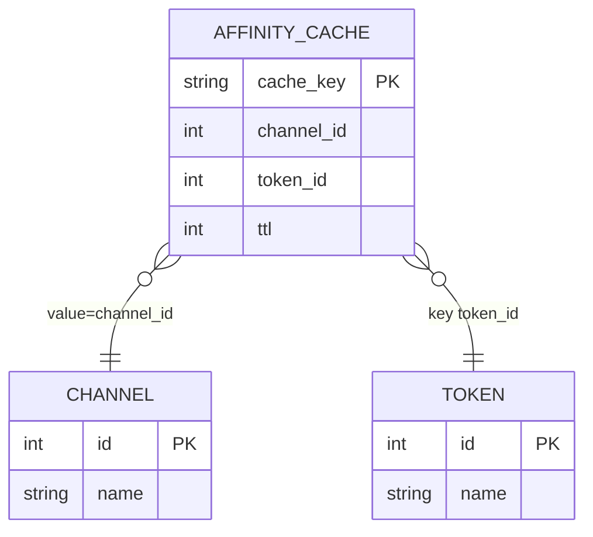

# 渠道亲和性绑定查看 数据库模型设计文档

## 文档信息

| 项目 | 内容 |
|---|---|
| Feature ID | P2_CHL_003_FEAT_渠道亲和性绑定查看 |
| 模型前缀 | chl_affinity（复用既有 `channels`、`tokens` 与运行时缓存） |
| 文档版本 | v1.0 |
| 数据库变更 | 无 |
| 设计依据 | 01_功能需求规格说明书.md、AGENTS_DATABASE_API_RULE.md、context/03_architecture/architecture.md |

## 1. 结论

本 Feature 不新增数据库表、字段、索引、迁移或字典数据。绑定关系是渠道亲和性运行时缓存中的短生命周期数据，来源为现有 HybridCache；渠道和令牌名称复用既有主库模型 `channels` 与 `tokens`。接口查询只构造内存响应，不持久化绑定明细。

## 2. 逻辑实体关系

`AFFINITY_CACHE` 是逻辑运行时实体，不是数据库表。缓存键命名空间为 `new-api:channel_affinity:v1`，缓存值为渠道 ID。仅能从全部键源均为 `context_int` 类型且键名为 `token_id` 的规则键中解析 token_id 的条目进入本接口结果。规则未启用规则名、模型名和分组名时，单段 token_id 键同样有效；键字段包含冒号时保持可逆解析。

## 3. 既有模型复用

### 3.1 channels

现有 `model.Channel` 作为渠道模型。读取字段为 `id` 和 `name`，不得将 `key`、`setting`、`param_override` 等敏感或无关字段返回接口。查询使用 GORM 既有模型，不新增外键。

### 3.2 tokens

现有 `model.Token` 作为令牌模型。读取字段为 `id` 和 `name`，不得返回 `key`。令牌不存在的缓存条目忽略。名称为空时接口展示层使用 `-`。

### 3.3 运行时缓存

| 项目 | 约定 |
|---|---|
| 类型 | `cachex.HybridCache[int]` |
| 命名空间 | `new-api:channel_affinity:v1` |
| 键 | 规则名、模型、分组和亲和值按规则拼接；亲和值为 token_id 时可解析 |
| 值 | channel_id（integer） |
| 过期 | 使用既有 TTL；枚举时只读取未过期项 |
| 存储优先级 | Redis 已配置使用 Redis，否则内存缓存 |
| 持久化 | 无，进程重启或 TTL 到期后自然消失 |

## 4. 字段映射与约束

| API 字段 | 来源 | 类型 | 约束 |
|---|---|---|---|
| channel_id | `channels.id`、缓存值 | integer | 大于 0；模型不存在时丢弃 |
| channel_name | `channels.name` | string | 空值展示 `-` |
| token_id | 缓存键 token_id | integer | 大于 0；同渠道去重、升序 |
| token_name | `tokens.name` | string | 空值展示 `-` |

缓存键无法解析 token_id、渠道 ID 非法、渠道或令牌记录不存在时，条目不形成逻辑关系。重复键或多个规则产生同一渠道与 token_id 关系时只保留一项。

## 5. 索引、迁移与字典

本 Feature 无 DDL、无新增索引、无外键、无公共字段新增、无字典字段，因此不生成数据库插入语句。既有 `channels.id`、`channels.name`、`tokens.id` 索引继续由现有模型和数据库维护。

## 6. 查询与一致性规则

1. 服务层先取得缓存键和值的快照，再批量查询关联渠道和令牌，最后在内存聚合排序。
2. Redis 与内存缓存不合并，避免同一绑定重复展示；缓存来源由现有 HybridCache 配置决定。
3. 查询失败时不返回部分数据，返回统一错误响应并记录 SysError。单条关联模型不存在属于脏缓存，忽略该条并继续返回其余有效条目。
4. 排序固定为渠道名称升序，同名渠道按 channel_id 升序；渠道内 token_id 升序。
5. 该查询不改变 `accessed_time`、渠道状态、缓存 TTL 或绑定关系。

## 7. 兼容性与性能

- SQLite、MySQL、PostgreSQL 均无需迁移，现有 GORM 查询保持兼容。
- 不使用原生 SQL、JSON 列、外键或数据库专用函数。
- 使用批量 `WHERE id IN (...)` 查询模型，避免按缓存条目逐条访问数据库。
- 缓存条目总量受既有容量配置限制，接口响应目标小于 500ms。

## 8. SSOT 验证

| 项目 | 结论 |
|---|---|
| 渠道名称 | 使用既有 Channel.Name，空值显示 `-` |
| 令牌列表 | 使用既有 Token.Id/Name，按 token_id 去重并升序 |
| 有效性 | 只读未过期缓存；不存在模型的条目忽略 |
| 聚合 | 一个渠道一行，多个令牌聚合到 tokens |
| 存储范围 | 无新增持久化数据 |
| 页面需求 | 无筛选、分页、导出、解绑和修改数据结构 |

---

**文档版本：** v1.0
**最后更新：** 2026-09-19
**作者：** lixuetao
